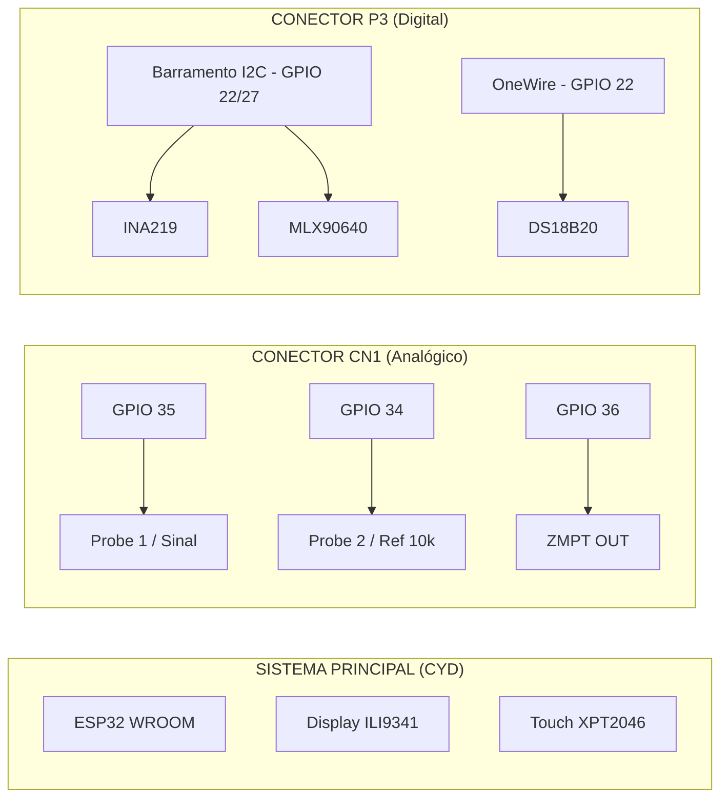

# BOM & Manual Técnico - Sondvolt v3.2

Este guia definitivo contém a **Bill of Materials (BOM)**, esquemas de ligação, diagramas de montagem e procedimentos de calibração para o projeto **Sondvolt**. Este documento foi projetado para ser o único guia necessário para a construção do dispositivo do zero.

---

## 1. Lista Completa de Materiais (BOM)

### 1.1. Núcleo de Processamento e Interface
| Qtd | Componente | Descrição Técnica | Função |
| :--- | :--- | :--- | :--- |
| 1 | **ESP32-2432S028R** | Placa CYD (Cheap Yellow Display) | Processamento, Display 2.8" e Touch |
| 1 | **MicroSD Card** | 8GB a 32GB (Classe 10 recomendada) | Armazenamento de logs e banco de dados |
| 1 | **Cabo Micro-USB** | Cabo de dados de alta qualidade | Programação e alimentação inicial |

### 1.2. Módulos de Sensoriamento
| Qtd | Componente | Especificação | Uso |
| :--- | :--- | :--- | :--- |
| 1 | **ZMPT101B** | Módulo Transformador AC Ativo | Medição de Tensão AC (Mains) |
| 1 | **INA219** | Módulo I2C High-Side Current | Medição DC (V/A/W) |
| 1 | **DS18B20** | Sensor de Temperatura TO-92 | Sonda Térmica |
| 1 | **MLX90640 BAA** | Módulo Matriz Térmica (32x24) | Câmera Térmica Infravermelha |

### 1.3. Seção de Segurança e Filtros (Crítico)
| Qtd | Componente | Valor / Código | Observação |
| :--- | :--- | :--- | :--- |
| 1 | **Fusível Rápido** | 5A (5x20mm) | Proteção de entrada AC |
| 1 | **Porta-Fusível** | Encaixe de Painel | Segurança contra choque |
| 1 | **Varistor** | **14D431** (430VDC/275VAC) | Proteção contra surtos |
| 1 | **Diodo TVS** | **P6KE400A** | Supressor de transientes rápidos |
| 5 | **Capacitor Cer.** | 100nF (104) | Decoplamento local nos sensores |
| 2 | **Capacitor Elet.** | 10µF 50V | Filtragem de barramento de sensores |

### 1.4. Hardware e Conectividade
| Qtd | Componente | Modelo / Tamanho | Função |
| :--- | :--- | :--- | :--- |
| 2 | **Bornes Banana** | 4mm Vermelho / 4mm Preto | Pontas de prova Multímetro |
| 2 | **Bornes AC** | Terminal de Parafuso Isolado | Entrada da Rede Elétrica |
| 1 | **Chave Rocker** | KCD1-101 (20x15mm) | Botão Liga/Desliga Geral |
| 2 | **Conectores JST** | **PH 2.0mm 4-vias** | Conexão nos ports CN1 e P3 |
| 1 | **Case ABS** | Plástico ou impresso em 3D | Alojamento do projeto |
| 10 | **Espaçadores** | Nylon M2.5 10mm | Fixação das placas internas |

---

## 2. Diagramas Visuais de Engenharia

### 2.1. Arquitetura de Barramentos (Mermaid)


### 2.2. Diagrama de Fiação AC (Segurança Máxima)
```text
[REDE 110V/220V] 
      │
      ├─────► [FUSÍVEL 5A] ─────► [CHAVE ON/OFF] ───┐
      │                                             │
      │           ┌─────────────────────────────────┴──┐
      │           │      CIRCUITO DE PROTEÇÃO          │
      │           │  [VARISTOR] <───> [DIODO TVS]      │
      │           └────────────────┬───────────────────┘
      │                            │
      └────────────────────────────┴─────► [ZMPT101B INPUT]
```

---

## 3. Guia de Cores e Bitolas (Padrão Industrial)

Utilize este código de cores para facilitar diagnósticos futuros:

| Barramento | Cor | Bitola (AWG) | Finalidade |
| :--- | :--- | :--- | :--- |
| **AC L (Fase)** | Marrom | 18 AWG | Entrada de energia AC |
| **AC N (Neutro)** | Azul Claro | 18 AWG | Retorno de energia AC |
| **DC +5V** | Vermelho | 22 AWG | Alimentação de sensores |
| **DC +3.3V** | Laranja | 24 AWG | Alimentação OneWire/Técnico |
| **GND** | Preto | 22 AWG | Referência comum |
| **I2C SDA** | Amarelo | 26 AWG | Dados Digitais |
| **I2C SCL** | Verde | 26 AWG | Clock Digital |
| **Analógico** | Roxo | 26 AWG | Sinais de medição |

---

## 4. Passo-a-Passo de Montagem

### Passo 1: Preparação da CYD
- Instale os conectores JST-PH nos ports CN1 e P3.
- Insira o cartão MicroSD formatado em FAT32.

### Passo 2: Montagem do Bloco AC
- Fixe o porta-fusível e a chave rocker no painel traseiro.
- Solde o varistor e o TVS diretamente nos terminais de entrada do módulo ZMPT101B para minimizar indutância parasita.

### Passo 3: Cabeamento de Sensores
- Solde os capacitores de 100nF o mais próximo possível dos terminais VCC/GND dos módulos INA219 e MLX90640.
- Utilize fios trançados (twisted pair) para as linhas SDA/SCL para reduzir interferência eletromagnética (EMI).

### Passo 4: Conexão das Probes
- Conecte o resistor de 10kΩ de precisão entre o GPIO 34 e o ponto de teste da Probe 2.
- Solde os cabos de silicone flexíveis nos bornes banana de 4mm.

---

## 5. Procedimento de Calibração (Auditado)

1.  **Ajuste de Zero (ZMPT101B)**: Com a entrada AC desconectada, ajuste o trimpot do módulo ZMPT até que a saída DC seja exatamente 2.5V (meia escala do ADC).
2.  **Calibração de Ganho AC**: Conecte um multímetro de referência à rede. No menu de calibração do Sondvolt, ajuste o fator de escala até que o valor no LCD coincida com o multímetro.
3.  **Calibração INA219**: Utilize uma carga de valor conhecido (ex: resistor de 10Ω 10W em 5V) para verificar a leitura de corrente e ajustar o offset se necessário.

---

## 6. Lista de Verificação (Checklist) Final

- [ ] Fusível de 5A instalado e testado.
- [ ] Varistor e TVS sem sinais de superaquecimento.
- [ ] Resistores Pull-up de 4.7kΩ presentes no barramento I2C/OneWire.
- [ ] Isolação entre bornes AC e bornes DC verificada (>10mm de distância).
- [ ] Capacitores de desacoplamento instalados em todos os módulos.
- [ ] Fiação AC utilizando bitola mínima de 18 AWG.

---
**Engenheiro Responsável:** Auditoria Sondvolt AI
**Data:** 25 de Abril de 2026
**Status:** PROJETO APROVADO PARA PRODUÇÃO
