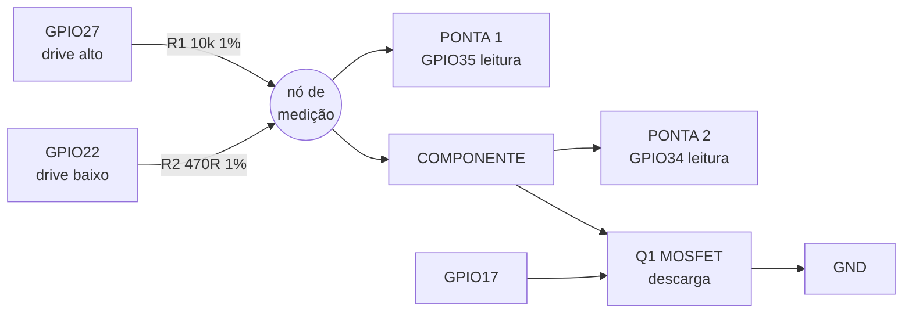

# Lista de materiais — Sondvolt v5.0

Tudo para montar o aparelho do zero, com **alternativas para cada peça**: duas mais baratas e duas melhores, dizendo o que se ganha e o que se perde em cada troca.

> **Legenda de preço** — os valores são ordens de grandeza no varejo brasileiro em 2026, para comparar peças entre si. Não são cotação.

---

## Índice

- [Como ler as tabelas](#como-ler-as-tabelas)
- [1. Núcleo](#1-núcleo)
- [2. Circuito de excitação das pontas](#2-circuito-de-excitação-das-pontas) — **obrigatório**
- [3. Placa de expansão "Bancada"](#3-placa-de-expansão-bancada) — Rev C
- [4. Sensores](#4-sensores)
- [5. Proteção elétrica](#5-proteção-elétrica) — **obrigatória para rede**
- [6. Mecânica e conectores](#6-mecânica-e-conectores)
- [7. Resumo de custo](#7-resumo-de-custo)
- [8. Montagem passo a passo](#8-montagem-passo-a-passo)
- [9. Calibração](#9-calibração)
- [10. Verificação final](#10-verificação-final)

---

## Como ler as tabelas

Cada peça tem um bloco assim:

| | Peça | Preço | O que muda |
|:--|:--|:--|:--|
| ⭐ | **modelo documentado** | ~R$ X | o que o firmware espera |
| 💸 | mais barato | ~R$ Y | o que você perde |
| 🏆 | melhor | ~R$ Z | o que você ganha |

O firmware funciona com qualquer opção. As linhas ⭐ são as que os valores padrão de `pins.h` e `config.h` assumem — usar outra pode exigir mudar uma constante, e isso está indicado.

---

## 1. Núcleo

### 1.1 Placa principal

| | Peça | Preço | Prós | Contras |
|:--|:--|:--|:--|:--|
| ⭐ | **ESP32-2432S028R** (CYD 2.8") | ~R$ 90 | Display, touch, cartão e ESP32 numa peça só. Toda a documentação assume ela | Zero GPIO livre. Sem PSRAM |
| 💸 | ESP32 DevKit + TFT ILI9341 avulso | ~R$ 65 | Mais GPIOs livres, dispensa o expansor | Precisa fiar 11 ligações à mão; sem caixa; touch geralmente pior |
| 💸 | ESP32-2432S024 (2,4") | ~R$ 80 | Mesma pinagem, mais compacto | Tela menor: o osciloscópio e a câmera térmica ficam apertados |
| 🏆 | ESP32-8048S043 (4,3" 800×480) | ~R$ 230 | **PSRAM de 8 MB**, tela grande. Osciloscópio com buffer muito maior, câmera térmica em tela cheia | Pinagem completamente diferente: exige reescrever `pins.h`. Sem touch resistivo |
| 🏆 | ESP32-S3 + display IPS 3,5" | ~R$ 190 | S3 tem mais RAM, USB nativo e ADC melhor | Reescrita da HAL: o S3 não tem os mesmos periféricos ADC/I2S |

> **A troca que mais compensa:** nenhuma. A CYD é barata e a documentação inteira é feita para ela. Trocar só vale se você precisa de PSRAM para um osciloscópio de verdade.

### 1.2 Cartão de memória

| | Peça | Preço | Prós | Contras |
|:--|:--|:--|:--|:--|
| ⭐ | **MicroSD 16 GB Classe 10** | ~R$ 25 | Sobra espaço para anos de log. Rápido o bastante para 10 MHz | — |
| 💸 | MicroSD 4 GB Classe 4 | ~R$ 15 | Suficiente: o banco todo tem 300 KB | O firmware cai para 4 MHz sozinho; abrir o histórico fica mais lento |
| 💸 | Nenhum | R$ 0 | Funciona: o catálogo de 53 componentes fica em flash | Sem histórico, sem Trabalhos, sem relatório, sem os 5.726 registros |
| 🏆 | MicroSD 32 GB A1 (SanDisk/Samsung) | ~R$ 40 | Muito mais confiável em gravação frequente. A1 é otimizado para acesso aleatório | Espaço que você não vai usar |
| 🏆 | 32 GB industrial (SLC) | ~R$ 130 | Aguenta ~100× mais ciclos de escrita. Para uso diário e pesado | Caro para o benefício num aparelho de bancada |

> Acima de 32 GB costuma dar problema com FAT32 e SdFat. Fique em 32 GB ou menos.

---

## 2. Circuito de excitação das pontas

> [!IMPORTANT]
> **Esta seção é obrigatória.** As pontas ficam em GPIO34 e GPIO35, que são **entrada apenas** no ESP32 e não conseguem aplicar tensão em nada. Sem este circuito, medir resistência e capacitância é fisicamente impossível — foi por isso que essas medições nunca funcionaram até a v3.2.


```mermaid
graph LR
    D1["GPIO27<br/>drive alto"] -->|R1 10k 1%| N(("nó de<br/>medição"))
    D2["GPIO22<br/>drive baixo"] -->|R2 470R 1%| N
    N --> P1["PONTA 1<br/>GPIO35 leitura"]
    N --> C["COMPONENTE"]
    C --> P2["PONTA 2<br/>GPIO34 leitura"]
    C --> Q["Q1 MOSFET<br/>descarga"]
    Q --> GND[GND]
    D3["GPIO17"] --> Q
```

### 2.1 Resistor de referência da faixa alta

Define a precisão de **todas** as medições de resistência acima de 2 kΩ.

| | Peça | Preço | Prós | Contras |
|:--|:--|:--|:--|:--|
| ⭐ | **10 kΩ 1% metal film 1/4 W** | ~R$ 0,30 | Erro de 1% na medição. Custo irrelevante | — |
| 💸 | 10 kΩ 5% carbono | ~R$ 0,10 | Funciona | **Limita todas as leituras a 5% de erro.** Economia de 20 centavos que estraga o aparelho |
| 💸 | 10 kΩ 1% SMD 0805 | ~R$ 0,15 | Mesma precisão, menor | Difícil de soldar à mão em fio |
| 🏆 | 10 kΩ 0,1% metal film | ~R$ 3,00 | Erro de 0,1%: o ADC vira o fator limitante, não o resistor | Só vale se você calibrar o ADC contra referência |
| 🏆 | 10 kΩ 0,01% Vishay foil | ~R$ 45 | Precisão de laboratório, deriva térmica quase nula | Absurdo neste projeto: o ADC do ESP32 tem ~9 bits efetivos |

> **A troca que mais compensa:** ficar no 1%. O 0,1% só faz sentido se você trocar o ADC por um externo (veja 3.6).

### 2.2 Resistor de referência da faixa baixa

| | Peça | Preço | Prós | Contras |
|:--|:--|:--|:--|:--|
| ⭐ | **470 Ω 1% metal film 1/4 W** | ~R$ 0,30 | ~5 mA de teste: corrente certa para junção de silício | — |
| 💸 | 470 Ω 5% carbono | ~R$ 0,10 | Funciona | 5% de erro abaixo de 2 kΩ |
| 💸 | 330 Ω 1% | ~R$ 0,30 | Mais corrente, melhor para LED de potência | Mude `PROBE_REF_RESISTOR_LOW` para 330.0f |
| 🏆 | 470 Ω 0,1% | ~R$ 3,00 | Melhora a medição de resistência baixa e de ESR | O ruído do ADC domina antes disso |
| 🏆 | 470 Ω 0,1% + 100 Ω 0,1% comutados | ~R$ 8,00 | Uma terceira faixa: mede abaixo de 1 Ω com resolução real | Precisa de mais uma linha do expansor e código de faixa |

### 2.3 MOSFET de descarga

| | Peça | Preço | Prós | Contras |
|:--|:--|:--|:--|:--|
| ⭐ | **2N7000** (TO-92) | ~R$ 0,80 | Vgs de limiar 2,1 V: aciona direto do GPIO de 3,3 V. Rds ~5 Ω | Corrente de descarga limitada; capacitor grande demora |
| 💸 | BS170 | ~R$ 0,70 | Equivalente direto, mesma pinagem | Praticamente idêntico |
| 💸 | Transistor 2N2222 + 1 kΩ na base | ~R$ 0,60 | Usa o que você já tem na gaveta | Consome corrente contínua de base; queda de 0,2 V no coletor |
| 🏆 | AO3400 (SOT-23) | ~R$ 1,50 | Rds de 35 mΩ: descarrega 1000 µF em uma fração do tempo | SMD, exige soldagem fina |
| 🏆 | IRLZ44N (TO-220) | ~R$ 4,00 | Rds de 22 mΩ e aguenta muita corrente. Descarga quase instantânea | Grande; capacitância de gate alta atrasa o acionamento |

> **A troca que mais compensa:** AO3400 se você mexe muito com fonte chaveada — a diferença na descarga de eletrolíticos grandes é visível.

### 2.4 Pontas de prova

| | Peça | Preço | Prós | Contras |
|:--|:--|:--|:--|:--|
| ⭐ | **Jaque banana 4 mm + cabo silicone** | ~R$ 18 o par | Padrão. Aceita qualquer ponta de multímetro | — |
| 💸 | Garra jacaré com cabo | ~R$ 8 | Prende sozinha no componente: ótimo para o modo Pareamento | Ruim em placa montada |
| 💸 | Pinos header + fio | ~R$ 3 | Serve para começar | Resistência de contato variável estraga a calibração |
| 🏆 | Pontas SMD tipo pinça | ~R$ 45 | Mede resistor 0603 direto na placa, sem soltar | Não serve para componente de furo passante |
| 🏆 | Kit banana + Kelvin 4 fios | ~R$ 120 | **Elimina a resistência dos cabos por completo.** Mede miliohm de verdade | Exige dois pinos a mais e mudança no firmware |

---

## 3. Placa de expansão "Bancada"

> Necessária para osciloscópio com atenuador, curva I-V, ripple, Zener acima de 3,3 V e câmera térmica. **Compile com `-e cyd-revc`.**

### 3.1 Expansor de linhas — a peça que viabiliza tudo

> [!NOTE]
> A CYD não tem **nenhum** GPIO livre. Os 24 pinos utilizáveis do ESP32-WROOM estão todos ocupados. O expansor dá 8 linhas de controle por I²C, a custo de zero pino.

| | Peça | Preço | Prós | Contras |
|:--|:--|:--|:--|:--|
| ⭐ | **PCF8574** (DIP-16 ou módulo) | ~R$ 6 | 8 linhas, I²C, endereço configurável. Sobra folga | Saída dreno-aberto: não aciona carga direto, só transistor |
| 💸 | 74HC595 (registrador) | ~R$ 2 | Mais barato, saída push-pull de verdade | Precisa de 3 GPIOs — que não existem. **Inviável aqui** |
| 💸 | PCF8574 clone sem marca | ~R$ 3 | Funciona | Endereço às vezes diferente do rotulado; confira com scanner I²C |
| 🏆 | MCP23017 | ~R$ 14 | **16 linhas**, push-pull real, interrupção por pino, pull-up interno | O dobro do preço para linhas que talvez não use |
| 🏆 | MCP23S17 (SPI) | ~R$ 16 | Muito mais rápido que I²C | Precisa de um CS: não há pino livre. **Inviável** |

> **A troca que mais compensa:** MCP23017 se você pretende adicionar relés de faixa depois. As 8 linhas do PCF8574 já ficam com 6 usadas.

### 3.2 Fonte auxiliar de 12 V (teste de Zener)

| | Peça | Preço | Prós | Contras |
|:--|:--|:--|:--|:--|
| ⭐ | **MT3608** (módulo boost ajustável) | ~R$ 7 | Sobe 5 V para 12 V, ajustável por trimpot. Habilitável | Ruído de chaveamento; Zener só até ~11 V |
| 💸 | XL6009 | ~R$ 9 | Mais corrente | Maior e mais ruidoso |
| 💸 | Nenhuma | R$ 0 | Todo o resto funciona | Sem teste de Zener acima de 3,3 V |
| 🏆 | MT3608 + LM317 pós-regulador | ~R$ 14 | Saída limpa: leitura de Zener bem mais estável | Perde ~1,5 V: máximo cai para ~10 V |
| 🏆 | Boost de 24 V + divisor 21:1 | ~R$ 22 | **Zener até 22 V**, cobrindo quase todo o comercial | Exige mudar o divisor de entrada e recalibrar |

### 3.3 Atenuador do osciloscópio

| | Peça | Preço | Prós | Contras |
|:--|:--|:--|:--|:--|
| ⭐ | **900 kΩ + 100 kΩ 1% + trimpot 10 pF** | ~R$ 3 | Divisor 10:1 clássico, entrada até 33 V | Precisa compensar o trimpot com onda quadrada |
| 💸 | 900 kΩ + 100 kΩ 5%, sem trimpot | ~R$ 1 | Funciona em DC e baixa frequência | Sem compensação, a onda quadrada sai distorcida acima de 1 kHz |
| 💸 | Ponta de osciloscópio 10:1 usada | ~R$ 20 | Já vem compensada e blindada | Ocupa um conector BNC |
| 🏆 | Divisor 1%+ trimpot + buffer TL072 | ~R$ 12 | Alta impedância de entrada: não carrega o circuito medido | Precisa de fonte simétrica ou rail-to-rail |
| 🏆 | Atenuador comutado 1x/10x/100x por relé | ~R$ 35 | Três faixas até 330 V | Consome 2 linhas do expansor e relés fazem ruído |

### 3.4 Acoplamento AC (medidor de ripple)

| | Peça | Preço | Prós | Contras |
|:--|:--|:--|:--|:--|
| ⭐ | **100 nF poliéster + 2× 100 kΩ (polarização)** | ~R$ 1,50 | Corte em ~16 Hz: passa 100/120 Hz da rede sem atenuar | — |
| 💸 | 100 nF cerâmico | ~R$ 0,30 | Funciona | Cerâmico Y5V muda de valor com tensão e temperatura |
| 💸 | 10 nF | ~R$ 0,20 | Se é o que você tem | Corte em 160 Hz: **atenua o ripple de 120 Hz**, que é justamente o que interessa |
| 🏆 | 1 µF poliéster + 100 kΩ | ~R$ 3 | Corte em 1,6 Hz: mede ripple de fonte com PFC lento | Maior; demora mais para estabilizar |
| 🏆 | 1 µF filme + buffer OPA2340 | ~R$ 18 | Entrada de alta impedância e resposta plana | Complexidade que só compensa em medição fina |

### 3.5 Shunt do traçador de curva

| | Peça | Preço | Prós | Contras |
|:--|:--|:--|:--|:--|
| ⭐ | **100 Ω 1% metal film** | ~R$ 0,30 | Corrente até 33 mA com boa resolução | Limita a corrente de teste |
| 💸 | 100 Ω 5% | ~R$ 0,10 | Funciona | 5% de erro no eixo de corrente |
| 💸 | 220 Ω 1% | ~R$ 0,30 | Se é o que tem | Menos corrente: curva de LED fica curta |
| 🏆 | 10 Ω 0,1% | ~R$ 3 | Até 330 mA: traça curva de transistor de potência | Menos resolução em corrente baixa |
| 🏆 | Shunt comutado 10/100/1k por expansor | ~R$ 6 | Três décadas de corrente | Mais 2 linhas do expansor |

### 3.6 ADC externo (opcional, mas transformador)

> Não está na montagem padrão. É a única troca que muda de patamar a precisão do aparelho.

| | Peça | Preço | Prós | Contras |
|:--|:--|:--|:--|:--|
| — | ADC interno do ESP32 | R$ 0 | Já existe, calibração de fábrica por eFuse | ~9 bits efetivos, não linear nas pontas |
| 🏆 | ADS1115 (16 bits, I²C) | ~R$ 18 | **16 bits, 4 canais, referência interna estável.** A precisão sobe de ~1% para ~0,05% | Só 860 amostras/s: não serve para o osciloscópio nem para True RMS |
| 🏆 | ADS1256 (24 bits, SPI) | ~R$ 95 | 24 bits a 30 kSPS. Precisão de instrumento de bancada | Precisa de um CS: **não há pino livre**. Exigiria o MCP23S17 e reescrita |

> **Recomendação honesta:** o ADS1115 para as medições DC lentas (resistência, capacitância, Vf, tensão DC) mantendo o ADC interno para o osciloscópio e o True RMS. É o melhor de dois mundos por R$ 18, mas exige código de roteamento por tipo de medição.

---

## 4. Sensores

### 4.1 Tensão AC

| | Peça | Preço | Prós | Contras |
|:--|:--|:--|:--|:--|
| ⭐ | **ZMPT101B** (módulo) | ~R$ 22 | Transformador: **isolação galvânica real** da rede. Boa linearidade | Precisa ajustar trimpot; satura acima de 250 V |
| 💸 | Divisor resistivo 1 MΩ + 4,7 kΩ | ~R$ 1 | Simples e barato | **Sem isolação: a rede fica ligada ao terra do ESP32.** Perigoso — não recomendo |
| 💸 | Transformador 220/6 V pequeno | ~R$ 15 | Isolação, e você talvez tenha um | Resposta ruim; distorce a forma de onda |
| 🏆 | ZMPT101B + amp-op de precisão | ~R$ 35 | Menos deriva térmica, leitura mais estável | Ganho extra a calibrar |
| 🏆 | HLW8032 ou BL0937 | ~R$ 30 | **Mede tensão, corrente, potência e fator de potência** com precisão certificada, já em digital | Interface UART; substituiria também o INA219 |

> **A troca que mais compensa:** HLW8032 se medir rede for uso frequente. Ele entrega potência real e fator de potência, que o ZMPT não dá.

### 4.2 Corrente e tensão DC

| | Peça | Preço | Prós | Contras |
|:--|:--|:--|:--|:--|
| ⭐ | **INA219** (módulo, shunt 0,1 Ω) | ~R$ 16 | 12 bits, I²C, ±3,2 A, mede tensão do barramento junto | Máximo de 26 V; shunt de 0,1 Ω derruba 0,32 V em 3,2 A |
| 💸 | ACS712 5 A | ~R$ 12 | Isolação por efeito Hall; mede AC também | Ruidoso; resolução pobre abaixo de 200 mA |
| 💸 | Shunt 0,1 Ω + o próprio ADC | ~R$ 1 | Baratíssimo | Sem amplificação: só serve acima de ~100 mA |
| 🏆 | INA226 | ~R$ 28 | **16 bits** e até 36 V. Quatro vezes mais resolução | Mesmo encapsulamento e I²C: troca quase direta no código |
| 🏆 | INA228 | ~R$ 55 | 20 bits, até 85 V, medição de energia acumulada | Caro; I²C em modo rápido |

> **A troca que mais compensa:** INA226. Mesmo endereço, mesmo barramento, quatro vezes a resolução por R$ 12 a mais.

### 4.3 Temperatura de contato

| | Peça | Preço | Prós | Contras |
|:--|:--|:--|:--|:--|
| ⭐ | **DS18B20** (TO-92 ou sonda selada) | ~R$ 12 | Digital, ±0,5 °C, um fio só, vários no mesmo barramento | Conversão de 750 ms; até 125 °C |
| 💸 | NTC 10 k + resistor | ~R$ 2 | Barato e rápido | Precisa de linearização; ocuparia um ADC que não sobra |
| 💸 | LM35 | ~R$ 6 | Saída analógica linear | Também ocupa ADC; sem pino livre |
| 🏆 | MAX6675 + termopar tipo K | ~R$ 35 | **Até 1024 °C**: mede ferro de solda e dissipador quente | SPI, precisa de CS — usaria uma linha do expansor |
| 🏆 | PT100 + MAX31865 | ~R$ 95 | Precisão de ±0,1 °C, padrão industrial | Caro e exagerado para bancada |

### 4.4 Câmera térmica

| | Peça | Preço | Prós | Contras |
|:--|:--|:--|:--|:--|
| ⭐ | **MLX90640** BAA (32×24, 110°) | ~R$ 320 | Resolução que mostra componente individual numa placa | Cara; 1,7 KB de RAM em coeficientes; 2 FPS a 400 kHz |
| 💸 | AMG8833 (8×8) | ~R$ 130 | Metade do preço, mesma I²C | 8×8 mostra "uma região quente", não *qual componente* |
| 💸 | MLX90614 (ponto único) | ~R$ 45 | Termômetro infravermelho sem contato | Um ponto só: não é imagem |
| 🏆 | MLX90640 BAB (55°) | ~R$ 330 | Campo estreito: mais detalhe na mesma placa, ideal para bancada | Precisa ficar mais longe para pegar a placa inteira |
| 🏆 | MLX90641 (16×12, 110°) | ~R$ 210 | Mais barata que a 90640 | Resolução baixa demais para componente individual |

> **A troca que mais compensa:** a versão **BAB (55°)** em vez da BAA. Mesmo preço, muito mais detalhe na distância de bancada.

---

## 5. Proteção elétrica

> [!WARNING]
> **Nada nesta seção é opcional se você vai medir a rede.** O firmware exige confirmação de que estas peças estão instaladas antes de liberar o modo multímetro, mas ele não tem como verificar — a confirmação é sua palavra.

### 5.1 Fusível

| | Peça | Preço | Prós | Contras |
|:--|:--|:--|:--|:--|
| ⭐ | **Fusível rápido 5 A 5×20 mm + porta-fusível** | ~R$ 6 | Corta antes de o erro virar incêndio | — |
| 💸 | Fusível de vidro comum 5 A | ~R$ 2 | Melhor que nada | Ação lenta: deixa passar o transiente que queima o ZMPT |
| 💸 | Fusível automotivo 5 A | ~R$ 3 | Fácil de achar | Feito para 12 V; a extinção do arco em 220 V não é garantida |
| 🏆 | Fusível cerâmico 5 A HRC | ~R$ 12 | Alta capacidade de ruptura: não estilhaça em curto franco | Mais caro |
| 🏆 | Disjuntor 5 A + fusível | ~R$ 40 | Rearmável, não precisa de reposição | Ocupa espaço na caixa |

### 5.2 Supressão de surto

| | Peça | Preço | Prós | Contras |
|:--|:--|:--|:--|:--|
| ⭐ | **Varistor 14D431 + TVS P6KE400A** | ~R$ 8 | Dupla camada: o varistor pega a energia, o TVS pega o transiente rápido | Varistor degrada com o uso; troque a cada surto grande |
| 💸 | Só varistor 14D431 | ~R$ 3 | Cobre a maior parte dos casos | Sem o TVS, o transiente de nanossegundos passa direto |
| 💸 | Só TVS P6KE400A | ~R$ 4 | Rápido | Sozinho não aguenta a energia de um surto de rede |
| 🏆 | Varistor 20D431 + P6KE400A + supressor de gás | ~R$ 25 | Três estágios, proteção de nível industrial | Só faz diferença em rede muito suja |
| 🏆 | Módulo DPS classe III pronto | ~R$ 60 | Certificado, com indicador de fim de vida | Grande; exige espaço na caixa |

> [!IMPORTANT]
> Solde o varistor e o TVS **direto nos terminais do ZMPT101B**, com pernas o mais curtas possível. A indutância de um fio de 5 cm já anula a proteção contra transiente rápido — é o erro mais comum de montagem.

### 5.3 Desacoplamento

| | Peça | Preço | Prós |
|:--|:--|:--|:--|
| ⭐ | **5× cerâmico 100 nF + 2× eletrolítico 10 µF 50 V** | ~R$ 4 | Um 100 nF junto ao VCC/GND de cada módulo. Sem isso, o I²C fica instável |
| 💸 | Só os 100 nF | ~R$ 1,50 | Cobre o essencial; o eletrolítico ajuda em transientes de corrente |
| 🏆 | 100 nF + 1 µF cerâmico por módulo | ~R$ 8 | Duas constantes de tempo: filtra ruído de alta e média frequência |

---

## 6. Mecânica e conectores

| Qtd | Peça | Preço | Alternativa barata | Alternativa melhor |
|:--|:--|:--|:--|:--|
| 1 | Caixa ABS | ~R$ 35 | Impressa em 3D (~R$ 12 de filamento) | Caixa de alumínio (~R$ 90) — blinda o ADC contra ruído |
| 1 | Chave rocker KCD1-101 | ~R$ 4 | Chave gangorra genérica (~R$ 2) | Chave com LED de estado (~R$ 8) |
| 2 | Borne AC de parafuso isolado | ~R$ 6 | Borne comum (~R$ 3) — pior isolação | Borne com tampa de segurança (~R$ 14) |
| 2 | Conector JST-PH 2,0 mm 4 vias | ~R$ 3 | Barra de pinos (~R$ 1) — solta com vibração | Conector com trava (~R$ 7) |
| 10 | Espaçador nylon M2,5 × 10 mm | ~R$ 8 | Parafuso + porca (~R$ 3) | Espaçador de latão (~R$ 15) — melhor aterramento |
| 1 | Placa perfurada 10×15 cm | ~R$ 8 | Ilhada (~R$ 5) | **PCB fabricada (~R$ 60 por 5)** — trilhas curtas melhoram muito o ruído |

### Código de cores da fiação

| Barramento | Cor | Bitola |
|:--|:--|:--|
| Fase AC | marrom | 18 AWG |
| Neutro AC | azul claro | 18 AWG |
| +5 V | vermelho | 22 AWG |
| +3,3 V | laranja | 24 AWG |
| GND | preto | 22 AWG |
| I²C SDA | amarelo | 26 AWG |
| I²C SCL | verde | 26 AWG |
| Analógico | roxo | 26 AWG |

---

## 7. Resumo de custo

| Configuração | O que faz | Custo |
|:--|:--|--:|
| **Mínima** | CYD + excitação das pontas. Identifica componente, mede R/C/ESR/Vf/hFE | **~R$ 115** |
| **Bancada** | + cartão, INA219, DS18B20, proteção AC, ZMPT | **~R$ 200** |
| **Completa (Rev C)** | + expansor, boost, atenuador, acoplamento, shunt. Osciloscópio, curva, ripple, gerador, Zener | **~R$ 240** |
| **Completa + térmica** | + MLX90640 | **~R$ 560** |
| **Turbinada** | Completa + INA226 + ADS1115 + MLX90640 BAB | **~R$ 610** |

> A câmera térmica sozinha custa mais que todo o resto do aparelho. É a única peça que exige decisão consciente.

---

## 8. Montagem passo a passo

### Passo 1 — Prepare a CYD

Instale os conectores JST-PH em CN1 e P3. Formate o cartão em FAT32 e copie `sd_files/sdcard/COMPBD.CSV` para a **raiz**.

### Passo 2 — Circuito de excitação (faça primeiro)

É a parte que faz o aparelho medir. Monte e valide antes de qualquer outra coisa: grave o firmware, entre em `Mais > Diagnóstico` e confirme que **Pontas de prova** está em OK.

| Ligação | De | Para |
|:--|:--|:--|
| R1 10 kΩ | GPIO27 (P3) | nó de medição |
| R2 470 Ω | GPIO22 (P3) | nó de medição |
| Ponta 1 | nó de medição | GPIO35 (CN1) e jaque vermelho |
| Ponta 2 | jaque preto | GPIO34 (CN1) e GND |
| Q1 dreno | nó de medição | — |
| Q1 fonte | GND | — |
| Q1 gate | GPIO17 | + 100 kΩ para GND |

### Passo 3 — Placa de expansão (Rev C)

| Ligação | De | Para |
|:--|:--|:--|
| PCF8574 SDA/SCL | GPIO27 / GPIO22 | pinos 15/14 do CI |
| PCF8574 A0/A1/A2 | GND | endereço 0x20 |
| P0 | boost MT3608 EN | via transistor |
| P1 | relé/JFET do acoplamento AC | — |
| P2 | caminho da saída do gerador | — |
| P3 | seleção do atenuador 1x/10x | — |
| P4 | inserção do shunt de 100 Ω | — |
| P5 | isolação das pontas | — |

> As saídas do PCF8574 são **dreno aberto**: acionam transistor, nunca carga direta. Use um 2N7000 ou um BSS138 em cada linha que precise chavear.

### Passo 4 — Bloco AC

Fixe porta-fusível e chave no painel traseiro. Solde varistor e TVS direto nos terminais do ZMPT. Mantenha **10 mm de isolação** entre bornes AC e DC.

### Passo 5 — Sensores

Um capacitor de 100 nF junto ao VCC/GND de cada módulo. Par trançado nas linhas SDA/SCL. Fios analógicos longe dos de rede.

### Passo 6 — Grave e verifique

```bash
pio run -t upload -e cyd-revc     # placa completa
pio run -t upload -e cyd-revb     # sem placa de expansão
pio run -t upload -e cyd          # fiação original
```

---

## 9. Calibração

1. **Zero do ZMPT.** Com a entrada AC desconectada, ajuste o trimpot até a saída ficar em **1,65 V**. Confira em `Mais > Diagnóstico`, linha Sensor AC.
2. **Ganho AC.** Meça a rede com multímetro de referência e ajuste com `multimeter_calibrate_zmpt()`.
3. **Pontas de prova.** `Mais > Calibrar` — pontas encostadas, depois afastadas. ~15 segundos.
4. **Atenuador do osciloscópio.** Ligue o gerador em 1 kHz, meça a própria saída com o atenuador em 10x e ajuste o trimpot até a onda quadrada ficar sem arredondamento nem overshoot.
5. **INA219.** Carga conhecida (10 Ω 10 W em 5 V) para conferir a corrente.

---

## 10. Verificação final

- [ ] Resistores de referência 10 kΩ e 470 Ω são de **1% ou melhor**
- [ ] MOSFET de descarga com pull-down de 100 kΩ no gate
- [ ] Fusível de 5 A instalado e testado
- [ ] Varistor e TVS soldados direto no ZMPT, **pernas curtas**
- [ ] Pull-up de 4,7 kΩ no barramento OneWire
- [ ] 100 nF em cada módulo
- [ ] 10 mm de isolação entre bornes AC e DC
- [ ] Fiação AC com bitola mínima de 18 AWG
- [ ] Trimpot do ZMPT em 1,65 V de repouso
- [ ] Endereços I²C confirmados: 0x20 expansor, 0x33 câmera, 0x40 INA219
- [ ] **`Mais > Diagnóstico` sem nenhuma linha em FALHA**
- [ ] Calibração das pontas executada

O último item resume todos os outros: o autoteste verifica display, touch, cartão, pontas, sensor térmico, INA219, ZMPT, expansor, câmera, buzzer e LEDs.
