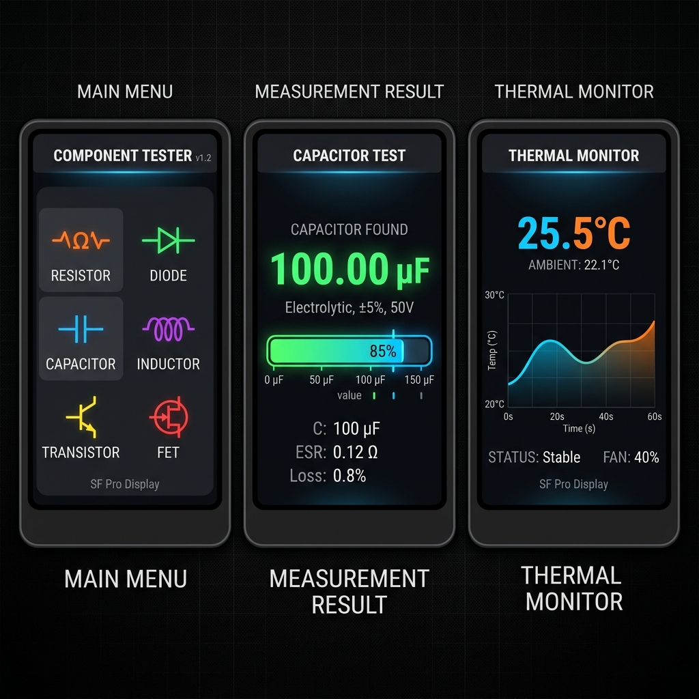
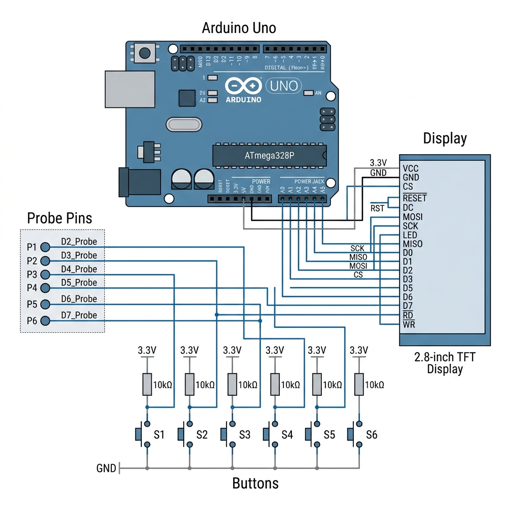

# 🚀 Component Tester PRO v2.0


## 🌟 Visão Geral

O **Component Tester PRO v2.0** é a evolução definitiva em diagnóstico de componentes eletrônicos para entusiastas e profissionais. Baseado no ecossistema Arduino, este dispositivo combina precisão técnica com uma interface visual rica e intuitiva.

> [!IMPORTANT]
> **Versão de Elite:** Esta versão v2.0 inclui interface grid 2x3, banco de dados de componentes real e suporte total a hardware.

---

## ✨ Funcionalidades Principais

| 🛠️ Medições Precisas | 📊 Análise & Histórico | 🌡️ Monitoramento Térmico |
| :--- | :--- | :--- |
| **13 Modos de Medição** incluindo Capacitores (ESR), Resistores, Indutores, Transistores (BJT/MOSFET) e muito mais. | **Histórico Inteligente** das últimas 10 medições com indicadores de status (Bom/Ruim) e estatísticas de uso. | **Sonda DS18B20** com alertas sonoros progressivos e feedback visual por LED para segurança. |

---

## 📱 Interface Visual (UI)

Nossa interface foi redesenhada do zero para oferecer a melhor experiência possível em uma tela TFT de 2.8".



### Navegação Dinâmica
- **Grid 2x3:** Acesso rápido às funções principais com ícones coloridos.
- **Barra de Status:** Informações persistentes sobre o estado do dispositivo.
- **Modo Escuro:** Conforto visual em qualquer ambiente de iluminação.

---

## 🛠️ Especificações de Hardware



| Componente | Especificação |
| :--- | :--- |
| **Cérebro** | Arduino Uno R3 (ATmega328P) |
| **Display** | TFT 2.8" ILI9341 SPI (320x240) |
| **Sensores** | Sonda DS18B20 (Digital) |
| **Armazenamento** | Micro SD Card + EEPROM Interna |
| **Controles** | 6 Botões Táteis de Alta Precisão |
| **Feedback** | Buzzer Ativo + LEDs Dual-Color |

---

## 📂 Estrutura da Documentação

Explore nossos guias detalhados para dominar o seu Component Tester Pro:

- 📖 **[Manual do Usuário](docs/MANUAL.md):** Guia completo de operação.
- 🔧 **[Guia de Hardware](docs/HARDWARE.md):** Esquemas e montagem.
- 📍 **[Pinagem & Conexões](docs/PINOUT.md):** Onde conectar cada fio.
- 🧩 **[Testando Componentes](docs/COMPONENTS.md):** Dicas para cada tipo de peça.
- ⚙️ **[Configurações](docs/CONFIG.md):** Calibração e personalização.
- 🛠️ **[Desenvolvimento](docs/DEVELOP.md):** Para quem quer modificar o código.

---

## 🚀 Como Iniciar

### 1. Requisitos
- [PlatformIO IDE](https://platformio.org/) (Recomendado)
- Arduino Uno R3
- Componentes listados em [HARDWARE.md](docs/HARDWARE.md)

### 2. Instalação
```bash
# Clone o repositório
git clone https://github.com/usuario/Component_Tester.git

# Entre na pasta
cd Component_Tester

# Compile e faça o upload
pio run --target upload
```

---

## 🤝 Contribuição

Contribuições são o que tornam a comunidade open source um lugar incrível para aprender, inspirar e criar. Qualquer contribuição que você fizer será **muito apreciada**.

1. Faça um Fork do projeto
2. Crie sua Feature Branch (`git checkout -b feature/AmazingFeature`)
3. Commit suas mudanças (`git commit -m 'Add some AmazingFeature'`)
4. Push para a Branch (`git push origin feature/AmazingFeature`)
5. Abra um Pull Request

---

## 📜 Licença

Distribuído sob a licença MIT. Veja `LICENSE` para mais informações.

---

<p align="center">
  Desenvolvido com ❤️ por <b>Leandro</b> & Comunidade v2.0
</p>