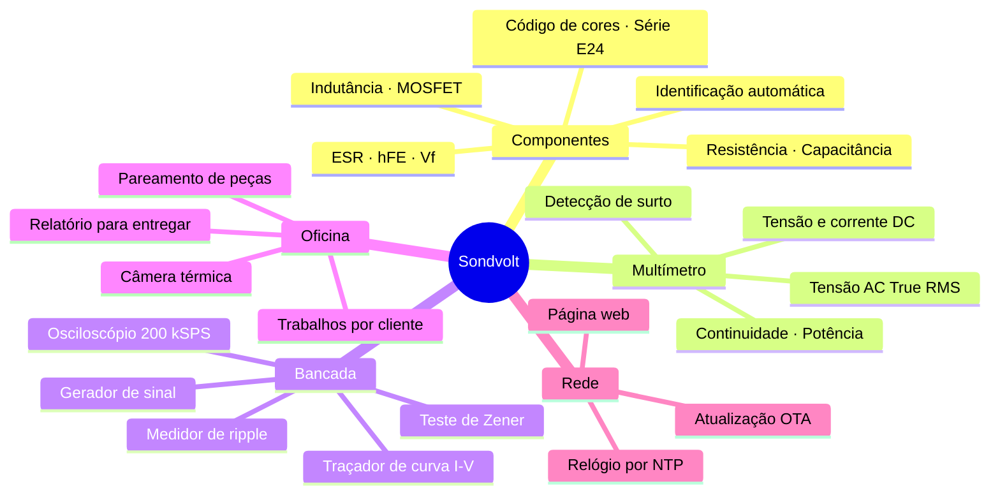
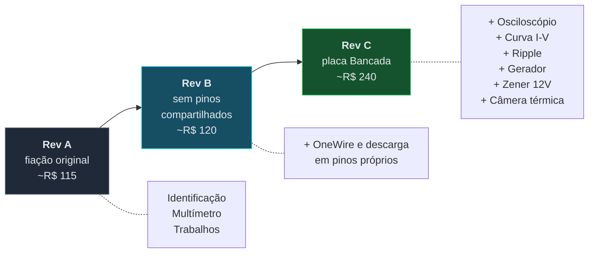
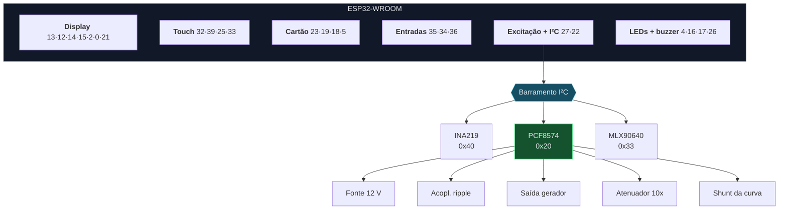
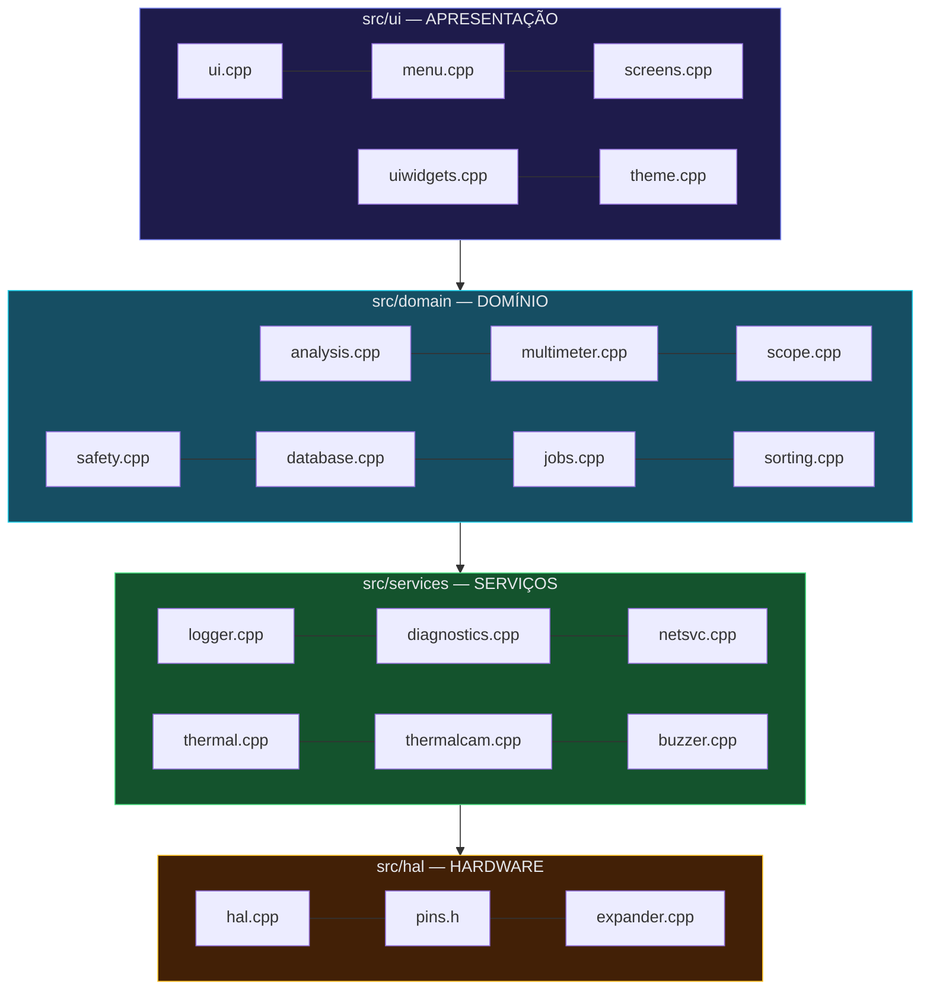
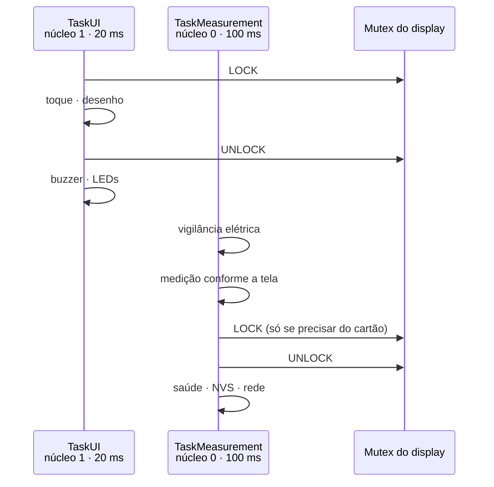

<div align="center">


# Sondvolt v5.1

**Testador de componentes, multímetro e instrumento de bancada para ESP32**

[](docs/CHANGELOG.md)
[](docs/LICENSE.md)
[](docs/PINOUT.md)
[](tools/hostcheck/check.sh)
[](docs/PINOUT.md#as-tr%C3%AAs-revis%C3%B5es)

[Começar](#começar) · [Recursos](#recursos) · [Hardware](#hardware) · [Documentação](docs/README.md) · [Changelog](docs/CHANGELOG.md)

</div>

---

## O que é

Um instrumento de bancada que cabe na palma da mão. Encoste um componente nas pontas e ele diz o que é e se está bom. Ligue na rede e ele vira multímetro True RMS. Ligue num sinal e ele vira osciloscópio.

Roda na **ESP32-2432S028R**, a placa conhecida como *Cheap Yellow Display* — ESP32, tela 2,8" e touch por cerca de R$ 90.


```mermaid
mindmap
  root((Sondvolt))
    Componentes
      Identificação automática
      Resistência · Capacitância
      ESR · hFE · Vf
      Indutância · MOSFET
      Código de cores · Série E24
    Multímetro
      Tensão AC True RMS
      Tensão e corrente DC
      Continuidade · Potência
      Detecção de surto
    Bancada
      Osciloscópio 200 kSPS
      Traçador de curva I-V
      Medidor de ripple
      Gerador de sinal
      Teste de Zener
    Oficina
      Trabalhos por cliente
      Relatório para entregar
      Pareamento de peças
      Câmera térmica
    Rede
      Página web
      Atualização OTA
      Relógio por NTP
```

---

## Começar

```bash
git clone https://github.com/lelebrr/SondVolt.git
cd SondVolt

pio run -t upload -e cyd        # fiação original da CYD
pio run -t upload -e cyd-revb   # sem pinos compartilhados
pio run -t upload -e cyd-revc   # com a placa de expansão "Bancada"
```

Formate o MicroSD em FAT32 e copie `sd_files/sdcard/COMPBD.CSV` para a raiz.

**Sem a placa em mãos?** Dá para verificar o firmware inteiro no PC:

```bash
bash tools/hostcheck/check.sh
```

Compila e **linka** todas as unidades de tradução com stubs das bibliotecas Arduino, nas três revisões de hardware.

> [!IMPORTANT]
> **O circuito de excitação das pontas é obrigatório.** As pontas ficam em GPIO34 e GPIO35, que são *entrada apenas* no ESP32 — sem um pino de saída alimentando o divisor, medir resistência e capacitância é fisicamente impossível. Esquema em **[docs/WIRING.md](docs/WIRING.md)**, peças na seção 2 da [BOM](BOM-Sondvolt.md).

---

## Recursos

<details open>
<summary><b>Identificação automática de componentes</b></summary>

Encoste o componente e o aparelho decide o que ele é:

| Detecta | Como |
|:--|:--|
| Resistor | divisor com referência de 1%, auto-range em duas faixas |
| Capacitor cerâmico ou eletrolítico | constante de tempo RC a 63,2% |
| Diodo de silício ou Schottky | tensão direta a 5 mA |
| LED (com cor estimada) | Vf entre 1,6 V e 3,4 V |
| Transistor NPN | ganho medido com base ativa e cortada |
| MOSFET canal N | retenção de carga no gate |
| Indutor | constante de tempo L/R |
| Curto, aberto, fusível | limiares de resistência |

</details>

<details>
<summary><b>Medições</b></summary>

| Grandeza | Faixa | Método |
|:--|:--|:--|
| Resistência | 0,5 Ω a 2 MΩ | divisor com auto-range |
| Capacitância | 1 nF a 4700 µF | constante de tempo RC |
| ESR | 0 a 200 Ω | pulso curto de 25 µs |
| Tensão direta | 0,15 a 3,2 V | corrente de teste de 5 mA |
| hFE | 8 a 2000 | Ic/Ib com dois estados de base |
| Indutância | 100 µH a 100 mH | decaimento L/R |
| Frequência | 1 Hz a 20 kHz | cruzamentos com histerese |
| Zener | 2 a 11 V | fonte auxiliar de 12 V *(Rev C)* |

</details>

<details>
<summary><b>Multímetro True RMS</b></summary>

- **AC**: 256 amostras, offset do ZMPT calculado das próprias amostras, detecção de surto quando o pico passa de 1,75× o RMS
- **DC**: via INA219 com o protocolo I²C correto e as escalas do datasheet
- **Continuidade** com apito, **resistência** e **potência**
- Um filtro independente por modo — trocar de modo não contamina a leitura

</details>

<details>
<summary><b>Instrumentos de bancada <i>(Rev C)</i></b></summary>

| Instrumento | O que resolve |
|:--|:--|
| **Osciloscópio** | 200 kSPS por DMA do I²S, gatilho, base de tempo, atenuador 10x. Vê PWM de fonte chaveada, ripple e sinal de áudio |
| **Traçador de curva I-V** | Mostra o joelho do diodo, a saturação do transistor e a região de condução do LED |
| **Medidor de ripple** | O teste que denuncia capacitor de filtro ressecado antes de a tensão média sair da faixa |
| **Gerador de sinal** | Onda quadrada de 1 Hz a 100 kHz para injetar em estágio de áudio |
| **Câmera térmica** | Matriz 32×24 que acha o componente quente na placa |

</details>

<details>
<summary><b>Oficina</b></summary>

**Trabalhos** — uma pasta por cliente no cartão. Toda medição feita com o trabalho ativo vai para o log dele. No fim, gera o relatório para entregar junto com o aparelho.

```
/TRABALHOS/LIQUID_J/
    JOB.INF        cliente, aparelho, datas
    MEDICOES.CSV   uma linha por medição
    NOTAS.TXT      observações do técnico
    RELATOR.TXT    relatório final
```

**Pareamento** — mede um lote e acha os pares casados dentro da tolerância. Para transistor de amplificador, o que importa não é o valor absoluto e sim quanto duas peças se parecem.

</details>

<details>
<summary><b>Rede</b></summary>

O WiFi do ESP32 nunca tinha sido ligado até a v5.0. Agora dá:

- **Página web** com leitura ao vivo e download do CSV, sem tirar o cartão
- **OTA**: atualiza o firmware sem cabo
- **NTP**: relógio de verdade, para o relatório ter data

Sem credenciais, sobe um ponto de acesso próprio (`Sondvolt`) para configurar pelo celular.

</details>

<details>
<summary><b>Segurança elétrica</b></summary>

- Vigilância contínua da tensão nas pontas fora do modo multímetro
- Bloqueio automático de 10 s após três detecções perigosas
- Confirmação obrigatória de fusível, varistor e TVS antes do modo multímetro
- Tela de alerta em tela cheia

> Na v3.2 essa proteção **nunca disparava** — comparava um número entre 0 e 1 com limiares em volts. Veja a seção 2 do [CHANGELOG](docs/CHANGELOG.md).

</details>

---

## Hardware

### As três revisões


```mermaid
flowchart LR
    A["<b>Rev A</b><br/>fiação original<br/>~R$ 115"] --> B["<b>Rev B</b><br/>sem pinos<br/>compartilhados<br/>~R$ 120"]
    B --> C["<b>Rev C</b><br/>placa Bancada<br/>~R$ 240"]

    A -.- A1["Identificação<br/>Multímetro<br/>Trabalhos"]
    B -.- B1["+ OneWire e descarga<br/>em pinos próprios"]
    C -.- C1["+ Osciloscópio<br/>+ Curva I-V<br/>+ Ripple<br/>+ Gerador<br/>+ Zener 12V<br/>+ Câmera térmica"]

    style A fill:#1f2937,stroke:#6b7280,color:#e5e7eb
    style B fill:#164e63,stroke:#22d3ee,color:#e5e7eb
    style C fill:#14532d,stroke:#4ade80,color:#e5e7eb
```

Um firmware compilado para a Rev C **roda na Rev A**: o que não encontra hardware se desativa sozinho, mostrando o que falta em vez de inventar número.

### A restrição que define o projeto

> [!NOTE]
> **A CYD não tem nenhum GPIO livre.** Somados display, touch, cartão, ADCs, LEDs, buzzer e I²C, os 24 pinos utilizáveis do ESP32-WROOM estão todos ocupados.

Por isso a Rev C usa um **expansor PCF8574** (~R$ 6): ele dá 8 linhas de controle sem gastar um único pino, porque mora no barramento I²C que já existe.

### Mapa de pinos


```mermaid
flowchart TB
    subgraph ESP["ESP32-WROOM"]
        direction TB
        T["<b>Display</b> 13·12·14·15·2·0·21"]
        TC["<b>Touch</b> 32·39·25·33"]
        SD["<b>Cartão</b> 23·19·18·5"]
        AD["<b>Entradas</b> 35·34·36"]
        EX["<b>Excitação + I²C</b> 27·22"]
        IO["<b>LEDs + buzzer</b> 4·16·17·26"]
    end

    EX --> I2C{{"Barramento I²C"}}
    I2C --> INA["INA219<br/>0x40"]
    I2C --> PCF["PCF8574<br/>0x20"]
    I2C --> MLX["MLX90640<br/>0x33"]

    PCF --> L0["Fonte 12 V"]
    PCF --> L1["Acopl. ripple"]
    PCF --> L2["Saída gerador"]
    PCF --> L3["Atenuador 10x"]
    PCF --> L4["Shunt da curva"]

    style ESP fill:#111827,stroke:#374151,color:#e5e7eb
    style I2C fill:#164e63,stroke:#22d3ee,color:#e5e7eb
    style PCF fill:#14532d,stroke:#4ade80,color:#e5e7eb
```

| Periférico | Pinos | Observação |
|:--|:--|:--|
| TFT ILI9341 | 13, 12, 14, 15, 2, 0, 21 | fixo na placa |
| Touch XPT2046 | 32, 39, 25, 33 | HSPI dedicado |
| MicroSD | 23, 19, 18, 5 | barramento próprio |
| Ponta 1 / Ponta 2 | 35 / 34 | **entrada apenas** |
| ZMPT101B | 36 | compartilhado com a IRQ do touch (não usada) |
| **Excitação das pontas** | **27 (10 kΩ), 22 (470 Ω)** | **obrigatório** |
| Descarga de capacitor | 17 (Rev A) · 16 (Rev B/C) | compartilhado com LED azul na Rev A |
| I²C | SDA 27, SCL 22 | compartilhado com a excitação |
| OneWire | 4 (Rev A) · 32 (Rev B/C) | compartilhado com LED vermelho na Rev A |
| Buzzer | 26 | |
| LED RGB | 4, 16, 17 | **ânodo comum: nível baixo acende** |

Os compartilhamentos da Rev A são arbitrados em software: o LED é apagado, o pino emprestado, e o LED restaurado ao estado anterior. Detalhes em **[docs/PINOUT.md](docs/PINOUT.md)**.

---

## Arquitetura


```mermaid
flowchart TB
    subgraph AP["src/ui — APRESENTAÇÃO"]
        ui[ui.cpp] --- menu[menu.cpp] --- screens[screens.cpp]
        widgets[uiwidgets.cpp] --- theme[theme.cpp]
    end
    subgraph DO["src/domain — DOMÍNIO"]
        analysis[analysis.cpp] --- multi[multimeter.cpp] --- scope[scope.cpp]
        safety[safety.cpp] --- db[database.cpp] --- jobs[jobs.cpp] --- sorting[sorting.cpp]
    end
    subgraph SE["src/services — SERVIÇOS"]
        logger[logger.cpp] --- diag[diagnostics.cpp] --- net[netsvc.cpp]
        thermal[thermal.cpp] --- tcam[thermalcam.cpp] --- buzzer[buzzer.cpp]
    end
    subgraph HW["src/hal — HARDWARE"]
        hal[hal.cpp] --- pins[pins.h] --- exp[expander.cpp]
    end

    AP --> DO --> SE --> HW

    style AP fill:#1e1b4b,stroke:#818cf8,color:#e5e7eb
    style DO fill:#164e63,stroke:#22d3ee,color:#e5e7eb
    style SE fill:#14532d,stroke:#4ade80,color:#e5e7eb
    style HW fill:#422006,stroke:#fbbf24,color:#e5e7eb
```

Duas tarefas FreeRTOS, cada uma fixada num núcleo:


```mermaid
sequenceDiagram
    participant U as TaskUI<br/>núcleo 1 · 20 ms
    participant M as TaskMeasurement<br/>núcleo 0 · 100 ms
    participant H as Mutex do display

    U->>H: LOCK
    U->>U: toque · desenho
    U->>H: UNLOCK
    U->>U: buzzer · LEDs
    M->>M: vigilância elétrica
    M->>M: medição conforme a tela
    M->>H: LOCK (só se precisar do cartão)
    M->>H: UNLOCK
    M->>M: saúde · NVS · rede
```

A regra: **a interface nunca faz medição lenta, e a medição nunca desenha uma tela inteira.**

---

## Documentação

| | Documento | Para quê |
|:--|:--|:--|
| 📖 | [Manual](docs/MANUAL.md) | operação completa |
| 🔌 | **[Esquema de ligação](docs/WIRING.md)** | **leia antes de soldar** |
| 📍 | [Pinagem](docs/PINOUT.md) | pinos, conflitos e as três revisões |
| 🧾 | [Lista de materiais](BOM-Sondvolt.md) | peças, com 2 alternativas mais baratas e 2 melhores cada |
| 🛠 | [Solução de problemas](docs/TROUBLESHOOTING.md) | quando algo não funciona |
| 💻 | [Guia do desenvolvedor](docs/DEVELOP.md) | arquitetura e convenções |
| 📋 | [Changelog](docs/CHANGELOG.md) | o que mudou e por quê |
| ⚠️ | [Segurança](docs/SAFETY.md) | proteção elétrica |

Índice completo em **[docs/README.md](docs/README.md)**.

---

## Segurança

> [!WARNING]
> **Nunca meça componentes em circuito energizado.** Descarregue capacitores antes — o aparelho tem função de descarga própria.
>
> Tensão máxima nas pontas 1 e 2: **3,3 V**. Para mais, use a entrada do multímetro.

> [!IMPORTANT]
> Para medir a rede (127 V ou 220 V) é **obrigatório**: fusível rápido de 5 A, varistor 14D431, diodo TVS P6KE400A e filtros RC.
>
> O firmware exige confirmação dessas peças antes de liberar o modo multímetro e bloqueia o aparelho por 10 segundos ao detectar tensão perigosa fora dele.

---

## Contribuindo

Contribuições são bem-vindas. Antes de abrir um PR:

```bash
bash tools/hostcheck/check.sh    # precisa passar limpo nas três revisões
```

O projeto compila **sem nenhum aviso** com `-Wall -Wextra`. Se a sua alteração gerar um aviso, ele é real — a flag `-w` da v3.2 escondia macros redefinidas com valores conflitantes.

Veja [CONTRIBUTING.md](docs/CONTRIBUTING.md).

---

<div align="center">

**MIT** · [Licença completa](docs/LICENSE.md)

*Feito para bancada de conserto, não para vitrine.*

</div>
