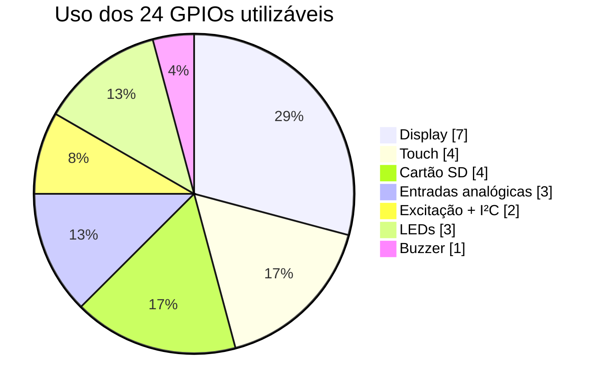

# Histórico de versões

---

## [5.1.0] — Setembro de 2026

Versão de correção e refinamento. Uma auditoria estática externa apontou 42 problemas; **41 se confirmaram** e foram corrigidos, 1 era falso positivo. No caminho, encontrei mais um bug grave que a auditoria não pegou.

### O bug que a auditoria não pegou

**A partição não tinha slot de OTA.** O projeto usava `huge_app.csv`, que reserva 3 MB para **uma única** partição de aplicação. Com ela, a atualização pela rede compila, liga e anuncia estar pronta — e falha na hora de gravar, porque `esp_ota_begin()` não encontra destino.

Ou seja: a v5.0 prometia OTA e a OTA nunca poderia funcionar.

Agora há uma tabela própria (`partitions_sondvolt.csv`) com dois slots de 1.920 KB, mais SPIFFS e área de coredump. O firmware da Rev C ocupa cerca de 700 KB, então sobra mais de 1 MB de folga em cada slot.

> **Ao atualizar:** mudar a tabela de partições invalida o layout anterior. A primeira gravação depois desta versão precisa ser por cabo, com `pio run -t erase` antes.

### Corrigido — críticos

| # | Problema | Efeito |
| :-- | :--- | :--- |
| 1 | `str_trim()` comparava o ponteiro com `NULL` em vez do início da string | String vazia ou só com espaços escrevia **antes** do buffer |
| 2 | `UNLOCK_TFT()` duplo em `draw_cpu_info_screen()` | Corrompia a contagem do mutex recursivo e liberava o lock de outra tarefa |
| 3 | 16 funções de desenho em `graphics.cpp` e o `fillScreen` do menu sem mutex | Escreviam no SPI sem sincronização, disputando o barramento com a outra tarefa |
| 4 | `strncpy` sem terminador em `valBuf` | `strlen()` seguinte lia fora do buffer |
| 5 | `HAL_BUS_I2C` e `HAL_BUS_PROBE_DRIVE` com mutexes **separados** | Os dois ocupam os MESMOS pinos (27 e 22). A exclusão não excluía nada: o INA219 podia iniciar transação no instante em que a excitação puxava o pino |
| 6 | Rotação do histórico usava temporário fixo de 16 e `% n` errado | Com `maxEntries > 16`, embaralhava o histórico em vez de ordená-lo |
| 7 | Câmera térmica semeava min/max com `pixels[0]` | Se aquele pixel viesse NaN, a imagem inteira ficava sem escala. A média também dividia a soma dos válidos pelos 768 totais |
| 8 | `analysis_measure_leakage()` usava o offset parasita dos cabos como capacitância | Resistência de fuga saía ordens de grandeza errada |
| 9 | `analysis_resistor_color_bands()` deixava NaN passar | `ohms < 1 \|\| ohms > 99e6` dá falso nas duas comparações para NaN; depois `(int)NaN` é UB e o índice do vetor de cores saía da faixa |
| 10 | `generate_db.py` emitia `ComponentDB`, tipo que não existe | O arquivo gerado nunca compilou. Também não escapava aspas — injeção de código, não só erro de sintaxe |

### Corrigido — robustez

- **`LOCK_TFT`/`UNLOCK_TFT` eram `if` nu** — dangling-else. Agora `do{...}while(0)`.
- **Mutex do display criado em inicializador estático.** Se falhasse, as macros viravam no-op silencioso e o barramento ficava sem proteção nenhuma. Agora é criado em `display_mutex_init()` e a falha reinicia o aparelho.
- **`xTaskCreatePinnedToCore` com retorno ignorado** — o aparelho podia ficar sem interface ou sem medição, em silêncio.
- **`safety_is_ac_danger()` barrava só acima de 180 V** enquanto `safety_check_voltage()` considera perigoso a partir de 50 V. Rede de 127 V passava como segura.
- **`millis() + timeout` no osciloscópio** quebra a cada 49 dias. Agora `millis() - início`.
- **Ripple media em duas passadas separadas**, com a média de uma aplicada nas amostras da outra, e o intervalo entre amostras *assumido* em 78 µs. Agora é uma passada só, guardando as amostras, com o tempo real medido por `micros()`.
- **`multimeter_read_dc_current()` devolvia `gLastReading.value` sob contenção** — o valor do modo anterior (uma tensão, por exemplo) apresentado como corrente.
- **`ina219_write_reg()` sem checar retorno** — o chip ficava nos padrões de fábrica e todas as leituras saíam com escala errada, sem aviso.
- **Calibração do ZMPT medindo através do filtro exponencial**, que carrega o estado anterior. Agora o filtro é zerado antes.
- **`i2c_device_present()` sondava sem arbitragem**, podendo colidir com medição em andamento.
- **`stream_sd_file()` segurava o mutex do display durante o download inteiro** e ignorava o retorno de `client.write()`, truncando o arquivo em silêncio quando o buffer TCP enchia.
- **`typeCount[24]` descartava `COMP_UNKNOWN` (99)** — um lote inteiro de peças não identificadas era reportado como "Resistor".
- **Polinômio do ADC em `float`** com coeficientes de 1e-14: o termo de quarta ordem perdia toda a precisão. Agora acumula em `double`.
- **Ícones sem bitmap não desenhavam nada** (MOSFET, WARNING, VOLTAGE, CRYSTAL) — o cartão ficava com um buraco que parecia defeito da tela. Agora há fallback vetorial.
- Mais: `getBytes` truncando o nome do trabalho, `hal_bus_*` sem teste de índice negativo, contagem regressiva do lockout dando a volta, hitbox do diálogo de segurança desalinhada dos botões desenhados, `colors[idx]` sem limite, corrente de Zener negativa, `draw_text_5x7` sem verificação de ponteiro nulo, toque no cabeçalho ativando o primeiro item da lista de ajustes.

### Falso positivo

A auditoria apontou divisão por zero em `screens.cpp` no cálculo de `count - start`. **Não procede:** a condição de parada do laço (`i + start < count`) já garante que o corpo só executa quando `start < count`, logo o divisor é sempre pelo menos 1. Adicionei a guarda explícita mesmo assim — custa uma linha e protege de uma refatoração futura.

### Removido — código morto

`splash.cpp` (nunca chamado — `graphics_draw_splash()` já existia), `utils.h`, `compat_tft.h`, `drawings.h`, `buttons.cpp`/`buttons.h` e `menu_handle()`. Esta última lia botões físicos que a CYD não tem: `HAS_PHYSICAL_BUTTONS` valia 0 e nada a chamava.

Também saíram `scratch/`, `tools/__pycache__/` e `.mimocode/`.

### Reorganizado

O `src/` passou de 60 arquivos soltos para cinco camadas que espelham a arquitetura:

```
src/
├── hal/        pins, hal, expander, display  (hardware)
├── domain/     analysis, multimeter, scope, safety, database, jobs, sorting
├── services/   logger, diagnostics, netsvc, thermal, buzzer, leds
├── ui/         ui, menu, screens, widgets, theme, graphics
└── assets/     bitmaps
```

### Sistema de design

Nova camada `theme.h` / `theme.cpp` como **dono único da aparência**. Antes, `theme.h` e `visual.h` definiam as mesmas macros com cores diferentes, e qual valia dependia da ordem dos includes — a mesma cor aparecia diferente em telas diferentes.

- **Rampa de quatro superfícies** em cinza-azulado. O azul leve afasta do preto morto e faz as cores de acento parecerem mais vivas por contraste
- **Escala de espaçamento** em múltiplos de 4. Não existe mais "um pouquinho mais de margem"
- **Cinco acentos** selecionáveis, cada um com versão cheia e recuada escolhida para continuar legível, não escurecida mecanicamente
- **`th_on()`** calcula a cor de texto pela luminância percebida do fundo (BT.601), em vez de chutar preto ou branco
- **Tema claro** com a mesma estrutura de quatro níveis, invertida, e acento escurecido para manter contraste sobre branco
- Componentes novos: `ui_card`, `ui_button` com estado pressionado, `ui_chip`, `ui_section` com linha que desvanece, `ui_header` com degradê e chevron desenhado, `ui_statusbar`, `ui_big_value`
- Cartões de menu redesenhados: barra de acento lateral em vez do "brilho neon" que sujava a tela

---

## [5.0.0] — Setembro de 2026

Versão de expansão. A v4.0 fez o aparelho funcionar; a v5.0 o transforma em instrumento de bancada e estação de trabalho.

### A restrição que definiu esta versão

> **A CYD não tem nenhum GPIO livre.** Somados display, touch, cartão, entradas analógicas, LEDs, buzzer e I²C, os 24 pinos utilizáveis do ESP32-WROOM estão todos ocupados.

Todo recurso novo teve que entrar por um dos dois caminhos: compartilhar um pino existente com arbitragem, ou passar pelo barramento I²C. A **Rev C** adota um expansor **PCF8574** (~R$ 6) que dá 8 linhas de controle sem gastar um único pino.



### Adicionado — instrumentos

| Instrumento | Módulo | Como funciona |
|:--|:--|:--|
| **Osciloscópio** | `scope.cpp` | Amostragem por DMA do I²S a até 200 kSPS, com gatilho de subida/descida, base de tempo ajustável e atenuador 10x. Mede Vpp, frequência, duty e média automaticamente |
| **Traçador de curva I-V** | `scope.cpp` | Varre o duty do PWM em 64 passos e mede a corrente pelo shunt. Distingue curva resistiva de junção e reporta o joelho |
| **Medidor de ripple** | `scope.cpp` | Entrada acoplada em AC sobre trilho DC. Reporta Vpp, RMS, porcentagem e frequência, com veredito automático |
| **Gerador de sinal** | `scope.cpp` | Onda quadrada de 1 Hz a 100 kHz com duty ajustável. Mostra a frequência real, que difere da pedida porque o LEDC divide um clock fixo |
| **Teste de Zener** | `scope.cpp` | Fonte auxiliar de 12 V pelo boost MT3608, com resistor de 4,7 kΩ limitando a 2 mA |
| **Câmera térmica** | `thermalcam.cpp` | MLX90640 32×24 com interpolação bilinear, três paletas, mira central, marcador do ponto quente e snapshot em CSV |

> **Por que onda quadrada e não senoidal:** os dois DACs do ESP32 (GPIO25 e GPIO26) estão ocupados pelo clock do touch e pelo buzzer, e não há pino para remanejá-los.

### Adicionado — oficina

**Sistema de Trabalhos** (`jobs.cpp`) — uma pasta por cliente no cartão. Toda medição feita com o trabalho ativo vai para o log dele, e no fim gera o relatório para entregar junto com o aparelho.

```
/TRABALHOS/LIQUID_J/
    JOB.INF        cliente, aparelho, datas, contadores
    MEDICOES.CSV   uma linha por medição
    NOTAS.TXT      observações do técnico
    RELATOR.TXT    relatório final
```

O trabalho ativo é lembrado na NVS e reaberto no próximo boot. Nomes com acento são normalizados para o FAT 8.3 sem perder letras — "João" vira `JOAO`, não `JO`.

**Pareamento** (`sorting.cpp`) — mede um lote de até 40 peças e forma os pares casados dentro da tolerância. Para transistor de amplificador ou ponte de medição, o que importa não é o valor absoluto e sim quanto duas peças se parecem: um par de 180 e 182 funciona melhor que um de 200 e 260.

### Adicionado — rede

O WiFi do ESP32 nunca tinha sido ligado. Agora, em `netsvc.cpp`:

- **Página web** servida da flash, sem CDN, para abrir mesmo em modo ponto de acesso sem internet. Leitura ao vivo por JSON e download do CSV em blocos, sem carregar o arquivo na RAM
- **OTA** com senha, fechando o cartão antes de gravar para não corromper o sistema de arquivos numa interrupção
- **NTP** para o relatório ter data real. Até aqui o log gravava `millis()` desde o boot, inútil num histórico de conserto
- **Ajuste manual de hora**, para quem nunca vai ligar o WiFi mas quer data no laudo
- **Fallback para ponto de acesso** (`Sondvolt`) quando as credenciais falham — sem isso, quem errasse a senha ficaria sem caminho para corrigi-la

O rádio só liga se o usuário habilitar. Ligar WiFi sem necessidade custa corrente, calor e tempo de boot.

> **Bluetooth ficou de fora de propósito.** O stack BT clássico consome ~300 KB de flash e disputa o mesmo rádio do WiFi. Entre os dois, o WiFi entrega página web, OTA e NTP; o BT entregaria um canal serial.

### Adicionado — hardware

**Expansor PCF8574** (`expander.cpp`) — 8 linhas de controle por I²C, com cache local de estado e degradação graciosa quando ausente. Os atalhos de alto nível encapsulam os tempos de acomodação, que são fáceis de esquecer e difíceis de depurar.

| Linha | Função |
|:--|:--|
| P0 | Habilita a fonte de 12 V |
| P1 | Insere o capacitor de acoplamento AC |
| P2 | Conecta a saída do gerador na ponta 1 |
| P3 | Seleciona o atenuador 1x / 10x |
| P4 | Insere o shunt do traçador |
| P5 | Isola as pontas durante medição de rede |

### Otimizado

**Calibração de fábrica do ADC.** Cada ESP32 sai com a curva do próprio conversor gravada nos eFuses. `hal_adc_to_volts()` agora usa `esp_adc_cal_raw_to_voltage()` quando disponível, corrigindo *a peça que está na sua placa* em vez de um chip médio. A aproximação polinomial da v4.0 virou o caminho alternativo para chips sem eFuse queimado.

**Tarefas fixadas nos núcleos.** `xTaskCreatePinnedToCore` em vez de `xTaskCreate`: interface no núcleo 1, medição no núcleo 0. O escalonador não migra mais as tarefas no meio de operação sensível a tempo.

**Sprite anti-flicker.** O painel do valor principal é montado em RAM e enviado de uma vez, em vez de apagar e repintar na tela. São 21 KB para a faixa do número; o sprite só é alocado se sobrar heap, e o desenho cai para o modo direto sem quebrar nada quando não sobra.

**Laços de espera ocupada corrigidos.** Quatro laços em `analysis.cpp` giravam sem ceder o processador — o de capacitância chegava a 3 segundos, o suficiente para matar de fome a tarefa ociosa. Agora cedem depois de um limiar em que o erro do yield é desprezível.

### Alterado

- **Três ambientes de build** (`cyd`, `cyd-revb`, `cyd-revc`) mais um de depuração. A biblioteca do MLX90640 só entra na Rev C: são 30 KB de flash e 1,7 KB de RAM que não fazem sentido em quem não tem a câmera
- **Telas novas em módulo próprio** (`screens.cpp`), com contrato explícito de entrada/desenho/toque/saída. A saída não é opcional: o osciloscópio monopoliza o ADC e o gerador segura o pino de excitação
- **Menu reorganizado** com o submenu "Bancada" e o atalho de Trabalhos na tela inicial
- **CI no GitHub Actions**: verificação no host nas três revisões, depois build real com relatório de uso de flash e RAM
- **Documentação com diagramas Mermaid**, renderizados nativamente pelo GitHub

### Custo em memória

| Recurso | Flash | RAM |
|:--|--:|--:|
| WiFi + servidor web + OTA | ~180 KB | ~40 KB (só com o rádio ligado) |
| Osciloscópio (I²S + buffers) | ~12 KB | ~4 KB |
| Câmera térmica (MLX90640) | ~30 KB | ~5 KB |
| Trabalhos + pareamento | ~14 KB | ~1 KB |
| Sprite anti-flicker | — | 21 KB (opcional) |
| **Total da v5.0** | **~240 KB** | **~70 KB** |

Sobram cerca de 2,3 MB de flash. A partição `huge_app.csv` dá 3 MB.

---

## [4.0.0] — Setembro de 2026

Versão de correção. A v3.2 tinha módulos inteiros escritos, corretos e **nunca executados**, medições fisicamente impossíveis com a pinagem publicada, e valores de tela que eram texto fixo em vez de medição.

### Corrigido — defeitos críticos

#### 1. Excitação das pontas era impossível no ESP32

`measurements.cpp` e `multimeter.cpp` chamavam `pinMode(GPIO35, OUTPUT)` para carregar o capacitor e polarizar o divisor. **GPIO34 a 39 do ESP32 são entrada apenas** — não têm driver de saída nem resistor de pull interno. As chamadas não tinham efeito algum.

A "capacitância" medida era o tempo que o ADC levava para ler, e a resistência dependia de o pino estar flutuando.

**Correção:** pino de excitação (GPIO27) alimentando as pontas por um resistor de referência de 10 kΩ, mais um caminho de 470 Ω (GPIO22) para a faixa baixa. `pins.h` ganhou `static_assert` que falha o build se alguém reintroduzir pinagem impossível.

#### 2. A proteção elétrica nunca disparava

```c
voltage = (adc - 2048) * ZMPT_SCALE_FACTOR / 2048;   // = 1.0
```

O resultado é um número entre 0 e 1, comparado com limiares de 50 V, 180 V e 250 V. Como 1,0 nunca chega a 50, `safety_check_voltage()` **sempre** devolvia "seguro" e o bloqueio automático jamais era acionado.

Havia um segundo defeito no mesmo caminho: o primeiro ramo capturava tudo acima de 50 V como CRÍTICO, tornando os ramos de 220 V e 127 V inalcançáveis.

#### 3. Faixa DC padrão multiplicava por 181

`multimeter_read_dc_voltage()` escolhia o fator com `if/else if/else` sem tratar `RANGE_AUTO` — que é o valor inicial. Caía no `else`, aplicando o fator de 600 V. Uma pilha AA de 1,5 V era exibida como 272 V.

#### 4. Metade dos subsistemas nunca era inicializada

| Função | Consequência |
|:--|:--|
| `buzzer_init()` | canal LEDC nunca configurado — nenhum som saía |
| `buzzer_update()` | tom iniciado nunca era desligado |
| `leds_init()` / `leds_update()` | pinos nunca viravam saída; padrões nunca avançavam |
| `db_init()` | banco de componentes nunca carregado |
| `calibration_init()` | offsets nunca lidos — cada boot sem calibração |
| `settings_load()` | preferências nunca restauradas |
| `logger_write()` | **nada era gravado no cartão**, apesar do manual prometer histórico |

#### 5. Valores falsos exibidos como medição

A tela mostrava strings constantes onde o usuário lê números: `ESR: 0.12 Ohms`, `hFE: 245`, `Vbe: 642mV`, `Q: 4.2 @ 1kHz`, `Rdc: 0.8 Ohms`, `Ir: < 10nA`, `Vloss: 0.8%`. Nenhum era medido.

#### 6. `src/ui.cpp` estava corrompido no repositório

50.856 bytes **todos zerados**, commitados assim (`3dc56b7`). O projeto não linkava. Restaurado de `36ad4f8`.

#### 7. INA219 sem protocolo I²C

Chamava `Wire.requestFrom()` sem escrever o ponteiro de registrador, não aplicava as escalas do datasheet (4 mV/bit no barramento, 10 µV/bit no shunt) e reinicializava o I²C a cada leitura. Os números eram aleatórios.

#### 8. LEDs invertidos

O LED RGB da CYD é de **ânodo comum**: nível baixo acende. O código escrevia `HIGH` para acender.

### Corrigido — robustez

- **True RMS com zero fixo** em 2048; qualquer desvio do trimpot virava tensão fantasma. Agora o zero é a média das próprias amostras
- **Filtro compartilhado entre modos**: trocar de modo contaminava a leitura por vários ciclos. Agora há um filtro por modo
- **Três mapeamentos de toque divergentes** em `main.cpp`, `buttons.cpp` e `safety.cpp`. Os botões das telas de segurança ficavam espelhados
- **`db_init()` não fazia parse** — contava linhas. E `DB_FILE_CSV` apontava para `/database.csv` enquanto o arquivo é `COMPBD.CSV`
- **Log sem rotação**: crescia até encher o cartão e falhar em silêncio
- **`logger_get_recent()` fragmentava o heap** alocando uma `String` por linha
- **`measurements_discharge_capacitor()` travava a tarefa** com onze `delay(100)` e reportava progresso simulado
- **`safety_update()` redesenhava a tela de bloqueio** a cada 100 ms da tarefa de medição
- **`draw_safety_alert_screen()` nunca era chamada** — existia desde a v3.1
- **Botão CALIBRAR não calibrava**: copiava a última leitura para os offsets
- **Sequência de boot fingia**: "Montando SD Card..." com `delay(400)` sem montar nada
- **DS18B20 bloqueava 800 ms** por leitura, e falhava com o LED vermelho aceso (GPIO4 compartilhado)
- **Macros duplicadas com valores diferentes**: `ZMPT_NUM_SAMPLES` valia 50 em `pins.h` e 128 em `config.h`; a paleta `THEME_*` estava em dois arquivos com cores diferentes. A flag `-w` escondia o aviso
- **`task_manager.cpp`** — 686 linhas de código morto. Removido

### Adicionado

Cinco módulos novos com **112 funções públicas**: `hal` (abstração de hardware e arbitragem de pinos), `analysis` (motor de medição), `diagnostics` (autoteste e NVS), `uiwidgets` (componentes visuais) e o catálogo de **53 componentes reais** em flash.

ESR · hFE · Vf · detecção de MOSFET · indutância · fuga · resistência interna de bateria · frequência · duty · código de cores · séries E6/E12/E24 · notação de engenharia · autoteste de 10 subsistemas · monitor de heap e pilha · watchdog · log rotativo · estatísticas de uso.

### Alterado

- **`-w` removido do build.** Compila limpo com `-Wall -Wextra`
- **Versões fixadas** para build reproduzível
- **Harness de verificação no host** (`tools/hostcheck/`)
- Removidos 19 arquivos `build_*.txt` e um `compile_commands.json` de 1,4 MB

---

## [3.2.0] — Abril de 2026

Motor True RMS, sistema de segurança multinível, detecção de surtos, tela de confirmação de hardware de proteção.

> **Nota da v4.0:** vários itens acima estavam implementados mas não operavam. O motor True RMS existia; a detecção de segurança que dependia dele comparava um número normalizado com limiares em volts.

---

## [3.0.0] — Abril de 2026

Porte para a ESP32-2432S028R, migração do display para TFT_eSPI e do armazenamento para SdFat.
