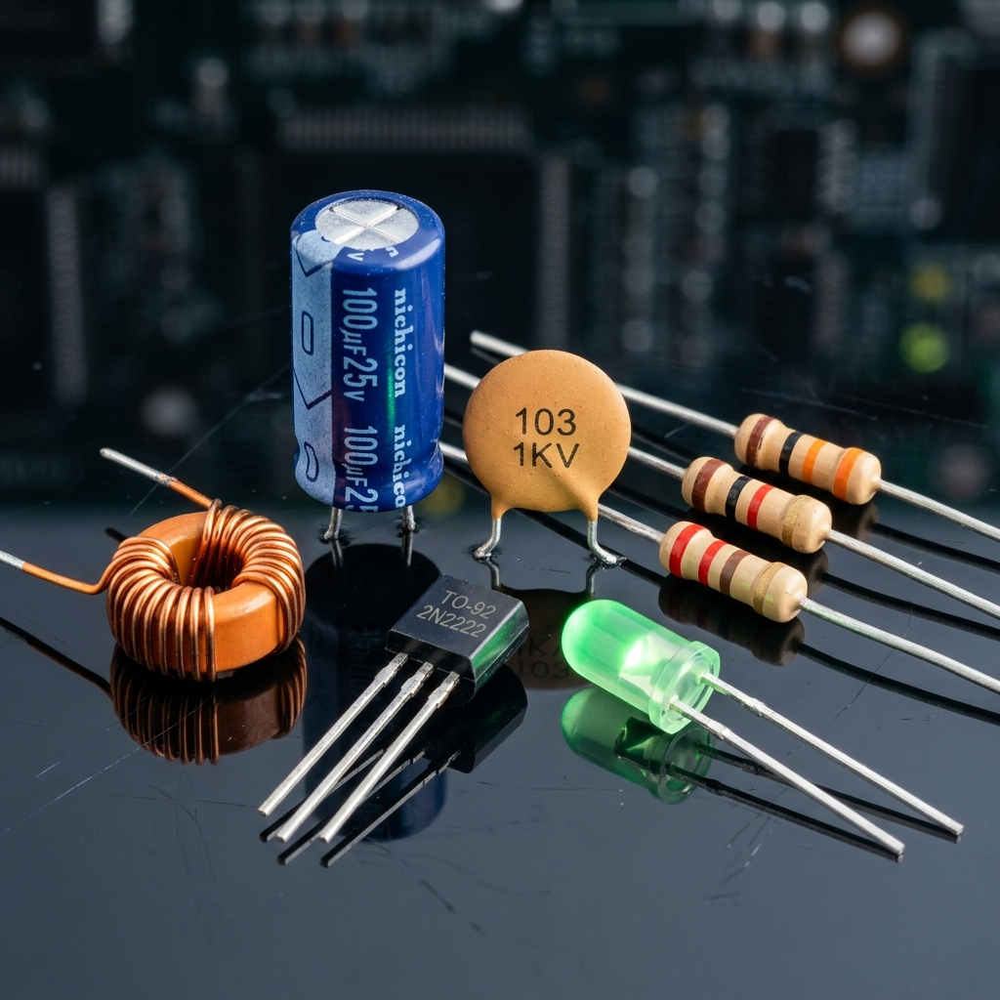

# Guia de Componentes - Component Tester PRO v2.0

## Índice

1. [Introdução](#1-introdução)
2. [Resistores](#2-resistores)
3. [Capacitores](#3-capacitores)
4. [Diodos e LEDs](#4-diodos-e-leds)
5. [Transistores](#5-transistores)
6. [Indutores](#6-indutores)
7. [Optocouplers](#7-optocouplers)
8. [Pontes Retificadoras](#8-pontes-retificadoras)
9. [Cabos e Fios](#9-cabos-e-fios)
10. [Tensões](#10-tensões)
11. [Frequência e PWM](#11-frequência-e-pwm)
12. [Sonda Térmica DS18B20](#12-sonda-térmica-ds18b20)

---



## 1. Introdução

Este documento explica como testar cada tipo de componente eletrônico usando o Component Tester PRO v2.0.

### Símbolos Usados

| Símbolo | Significado |
|---------|-------------|
| ✅ | Passo/ação correta |
| ⚠️ | Aviso importante |
| 💡 | Dica útil |

---

## 2. Resistores

### O que é um Resistor?

Um resistor é um componente que limita o fluxo de corrente elétrica. Ele é usado para:
- Limitar corrente
- Divisor de tensão
- Pull-up/Pull-down

### Como Identificar

**Código de cores:**
```
┌─────────────────────────────────────────────────────────┐
│  Exemplo: Resistor 10kΩ (marrom, preto, laranja)     │
│                                                         │
│  ┌───┬───┬───┬────┐                                  │
│  │ ■ │ ■ │ ■ │  ○ │                                   │
│  └───┴───┴───┴────┘                                  │
│  Marrom│Preto│Laranja                                 │
│   1    │  0  │ ×1kΩ  = 10kΩ                          │
└─────────────────────────────────────────────────────────┘
```

**Resistores SMD:**
```
┌─────────────────────────────────────────────────────────┐
│  103 = 10kΩ  │  472 = 4.7kΩ  │  101 = 100Ω           │
│  10 = 1Ω    │  0 = 0Ω       │  = resistor de fuga   │
└─────────────────────────────────────────────────────────┘
```

### Como Testar

```
┌─────────────────────────────────────────────────────────┐
│  PASSO 1: Conecte o resistor                            │
│                                                         │
│  Probe (+) ──┬── Uma ponta do resistor                 │
│              │                                          │
│  Probe (-) ─┴── Outra ponta                           │
│                                                         │
│  A polaridade não importa!                             │
└─────────────────────────────────────────────────────────┘
```

```
┌─────────────────────────────────────────────────────────┐
│  PASSO 2: Selecione "Res" no menu Medir              │
│                                                         │
│  ┌────────────────────┐                                 │
│  │  Cap              │                                 │
│  │► Res            │ ← Selecione este                │
│  │  Diod            │                                 │
│  │  Trans           │                                 │
│  └────────────────────┘                                 │
│                                                         │
│  Pressione OK                                           │
└─────────────────────────────────────────────────────────┘
```

### Resultados Esperados

| Resultado | Significado | Ação |
|-----------|-------------|------|
| Valor em Ω ou kΩ | Resistor OK | Nenhuma |
| OPEN/HIGH | Aberto (queimado) | Substitua |
| 0Ω | Curto | Substitua |

### Valores Típicos e Tolerância

| Valor | Código | Usado em |
|-------|--------|----------|
| 10Ω | marrom-preto-preto | LEDs |
| 100Ω | marrom-preto-marrom | Pull-ups |
| 1kΩ | marrom-preto-verde | Circuitos |
| 10kΩ | marrom-preto-laranja | Sensores |
| 100kΩ | marrom-preto-amarelo | Circuitos |
| 1MΩ | marrom-preto-verde | Circuitos |

---

## 3. Capacitores

### O que é um Capacitor?

Um capacitor armazena energia em um campo elétrico. Tipos:
- Cerâmico (não polarizado)
- Eletrolítico (polarizado)
- Tantalo (polarizado)
- Filme (não polarizado)

### Como Identificar

**Eletrolíticos:**
```
┌─────────────────────────────────────────────────────────┐
│  Exemplo: 100µF 25V                                    │
│                                                         │
│  ┌─────────────────────┐                                │
│  │      ───(─)        │  ← Símbolo                     │
│  │    ╱    │          │                                │
│  │   ─     │  100µF   │  ← Valor                      │
│  │    ╲    │  25V     │  ← Tensão máx                 │
│  └────┬────┘          │                                │
│       │               │                                │
│       └──────── Negativo (stripe)                       │
│                                                         │
│  Terminal + é mais longo                              │
└─────────────────────────────────────────────────────────┘
```

**Cerâmicos:**
```
┌─────────────────────────────────────────────────────────┐
│  104 = 100nF  │  103 = 10nF  │  102 = 1nF             │
│  472 = 4.7nF  │  471 = 470pF                          │
└─────────────────────────────────────────────────────────┘
```

### Como Testar

```
┌─────────────────────────────────────────────────────────┐
│  PASSO 1: Descargue o capacitor primeiro!             │
│                                                         │
│  ⚠️ IMPORTANTE: Capacitores grandes podem guardar      │
│     carga perigosa. Use um resistor de 1kΩ para       │
│     descargar antes de testar.                          │
└─────────────────────────────────────────────────────────┘
```

```
┌─────────────────────────────────────────────────────────┐
│  PASSO 2: Conecte o capacitor                         │
│                                                         │
│  Para capacitores NÃO POLARIZADOS:                     │
│  Probe (+) ──┬── Qualquer terminal                     │
│              │                                          │
│  Probe (-) ─┴── Outro terminal                        │
│                                                         │
│  Para capacitores POLARIZADOS (eletrolíticos):         │
│  Probe (+) ──┬── Terminal + (mais longo)               │
│              │                                          │
│  Probe (-) ─┴── Terminal - (stripe)                  │
└─────────────────────────────────────────────────────────┘
```

```
┌─────────────────────────────────────────────────────────┐
│  PASSO 3: Selecione "Cap" no menu Medir              │
│                                                         │
│  Pressione OK                                           │
└─────────────────────────────────────────────────────────┘
```

### Resultados Esperados

| Resultado | Significado | Ação |
|-----------|-------------|------|
| Valor em µF | Capacitor OK | Nenhuma |
| ~0 ou muito baixo | Aberto | Substitua |
| Muito maior que o nominal | Curto | Substitua |

### Faixa de Medição

| Tipo | Range |
|------|-------|
| Cerâmico | 1nF - 1µF |
| Eletrolítico | 1µF - 1000µF |
| Tantalo | 1µF - 100µF |

⚠️ **Limitações:** Capacitores muito pequenos (< 1nF) podem não ser detectados.

---

## 4. Diodos e LEDs

### O que é um Diodo?

Um diodo permite corrente em apenas uma direção. Usos:
- Retificação
- Proteção
- LED (emissor de luz)

### Como Identificar Diodo

```
┌─────────────────────────────────────────────────────────┐
│  Símbolo:                                              │
│                                                         │
│    ──▶|──  (seta aponta para a barra)                 │
│                                                         │
│  Conexão física:                                        │
│                                                         │
│  ┌───┬──▶|───┐                                        │
│  │ A │    │ K │  A = Ânodo, K = Cátodo               │
│  └───┴────┴───┘                                        │
│       │                                                │
│       └── stripe/branca = cátodo                       │
└─────────────────────────────────────────────────────────┘
```

### Como Identificar LED

```
┌─────────────────────────────────────────────────────────┐
│  Identificação visual:                                 │
│                                                         │
│  ┌──────────────────────┐                              │
│  │   ~~~~~~~~~~~~       │  ← Bolha/encapsulamento    │
│  │   ╱   │    │         │                              │
│  │  ──  │    │         │                              │
│  │   ╲   │    │         │                              │
│  └────┬──┴────┴───────┘                              │
│       │                                                │
│       │ Terminal + (mais longo)                         │
│       └ Terminal - (mais curto)                         │
└─────────────────────────────────────────────────────────┘
```

### Como Testar

```
┌─────────────────────────────────────────────────────────┐
│  PASSO 1: Conecte o diodo/LED                         │
│                                                         │
│  Probe (+) ──┬── Ânodo (+)                            │
│              │                                          │
│  Probe (-) ─┴── Cátodo (-)                            │
│                                                         │
│  💡 Para LEDs, se não acender, tente inverter         │
│     a conexão                                          │
└─────────────────────────────────────────────────────────┘
```

```
┌─────────────────────────────────────────────────────────┐
│  PASSO 2: Selecione "Diod" no menu Medir             │
│                                                         │
│  Pressione OK                                           │
└─────────────────────────────────────────────────────────┘
```

### Resultados

| Resultado | Significado | LED acende? |
|-----------|-------------|------------|
| "Anodo P1, Katodo P2" | OK, ânodo no probe 1 | Sim |
| "Anodo P2, Katodo P1" | OK, ânodo no probe 2 | Sim |
| "No Diode" | Aberto/invertido | Não |

### Tensão de Forward (Vf)

| Componente | Tensão Típica |
|-----------|---------------|
| Diodo 1N4007 | 0.6 - 0.7V |
| LED Vermelho | 1.8 - 2.0V |
| LED Laranja | 2.0 - 2.1V |
| LED Amarelo | 2.1 - 2.2V |
| LED Verde | 2.0 - 2.2V |
| LED Azul | 2.5 - 3.0V |
| LED Branco | 3.0 - 3.5V |

---

## 5. Transistores

### O que é um Transistor?

Transistor é um半导体 que pode amplify ou chavear sinais. Tipos:
- BJT (Bipolar Junction Transistor)
- MOSFET (Field Effect)

Este testador detecta **BJT NPN** apenas.

### Identificação de Transistores BJT

```
┌─────────────────────────────────────────────────────────┐
│  Símbolos:                                              │
│                                                         │
│  NPN:                                                    │
│    C                                                     │
│    │                                                     │
│  B─▶                                                    │
│    │                                                     │
│    E                                                     │
│  (seta saindo do emissor)                              │
│                                                         │
│  PNP:                                                    │
│    C                                                     │
│    │                                                     │
│  B◀─                                                    │
│    │                                                     │
│    E                                                     │
│  (seta entrando no emissor)                             │
└─────────────────────────────────────────────────────────┘
```

### Pinagem Típica (TO-92)

```
┌─────────────────────────────────────────────────────────┐
│  Vista de baixo (lado plano):                          │
│                                                         │
│      E  B  C                                            │
│      │  │  │                                            │
│      ○  ○  ○                                            │
│           │                                              │
│           └── Coletor (maior corrente)                  │
│                                                         │
│  Mais comum: E-B-C (esquerda pra direita)              │
│  Alternativo: C-B-E                                     │
└─────────────────────────────────────────────────────────┘
```

### Como Testar

```
┌─────────────────────────────────────────────────────────┐
│  PASSO 1: Conecte o transistor                         │
│                                                         │
│  ⚠️ Não precisa saber a pinagem! O dispositivo         │
│     testa automaticamente todas as combinações           │
│                                                         │
│  Probe 1 ──┬── Qualquer terminal                       │
│             │                                           │
│  Probe 2 ─┴── Outro terminal                           │
└─────────────────────────────────────────────────────────┘
```

```
┌─────────────────────────────────────────────────────────┐
│  PASSO 2: Selecione "Trans" no menu Medir             │
│                                                         │
│  Pressione OK                                           │
└─────────────────────────────────────────────────────────┘
```

### Resultados

| Resultado | Significado | Beta típico |
|-----------|-------------|-------------|
| "BJT NPN" + Beta | Transistor OK | 50-300 |
| "Not Found" | Ruim ou não-NPN | - |

### O que é Beta (hFE)?

Beta é o ganho de corrente:
```
Ic = β × Ib

Exemplo:
- β = 100
- Ib = 1mA
- Ic = 100mA
```

| Tipo de Transistor | Beta Típico |
|-------------------|-------------|
| General purpose | 50-200 |
| Audio/driver | 100-400 |
| High current | 20-50 |

---

## 6. Indutores

### O que é um Indutor?

Um indutor armazena energia em um campo magnético. Usos:
- Filtros
- Fontes
- Transformadores

### Como Identificar

```
┌─────────────────────────────────────────────────────────┐
│  Tipos de indutores:                                   │
│                                                         │
│  ┌──────┐  ┌──────┐  ┌────────┐  ┌─────┐             │
│  │○○○○○○│  │━━━━━━│  │╔════╗│  │ ══ │             │
│  │      │  │      │  │║    ║│  │     │             │
│  │SMD   │  │Radial│  │╚════╝│  │Toroid│             │
│  └──────┘  └──────┘  └────────┘  └─────┘             │
│                                                         │
│  Valor impresso:                                        │
│  101 = 100µH  │  102 = 1mH  │  103 = 10mH            │
└─────────────────────────────────────────────────────────┘
```

### Como Testar

```
┌─────────────────────────────────────────────────────────┐
│  PASSO 1: Conecte o indutor                            │
│                                                         │
│  Probe (+) ──┬── Um terminal                           │
│              │                                          │
│  Probe (-) ─┴── Outro terminal                        │
└─────────────────────────────────────────────────────────┘
```

```
┌─────────────────────────────────────────────────────────┐
│  PASSO 2: Selecione "Ind" no menu Medir               │
│                                                         │
│  Pressione OK                                           │
└─────────────────────────────────────────────────────────┘
```

### Resultados

| Resultado | Significado |
|-----------|-------------|
| Valor em µH ou mH | Indutor OK |
| "OPEN" | Aberto (queimado) |

---

## 7. Optocouplers

### O que é um Optocoupler?

Um optocoupler (ou optoisolador) combina um LED e um fototransistor em um mesmo encapsulamento, isolando eletricamente dois circuitos.

### Como Identificar

```
┌─────────────────────────────────────────────────────────┐
│  Estrutura interna:                                    │
│                                                         │
│   ┌────────────────────────┐                           │
│   │   LED    │  Transistor │                           │
│   │   (entrada)│ (saída)   │                           │
│   └──────────┼────────────┘                           │
│              │ (isolamento óptico)                      │
│   Pino 1-2: LED                                        │
│   Pino 3-4: Fototransistor                             │
└─────────────────────────────────────────────────────────┘
```

### Como Testar

```
┌─────────────────────────────────────────────────────────┐
│  PASSO 1: Conecte (apenas o LED!)                     │
│                                                         │
│  Probe (+) ──┬── Pino 1 (LED ânodo)                    │
│              │                                          │
│  Probe (-) ─┴── Pino 2 (LED cátodo)                  │
│                                                         │
│  ⚠️ Não conecte os pinos do transistor!               │
└─────────────────────────────────────────────────────────┘
```

```
┌─────────────────────────────────────────────────────────┐
│  PASSO 2: Selecione "Opto" no menu Medir              │
│                                                         │
│  Pressione OK                                           │
└─────────────────────────────────────────────────────────┘
```

### Resultados

| Resultado | Significado |
|-----------|-------------|
| WORKING | Optocoupler OK |
| FAILED | Problema no LED ou transistor |

---

## 8. Pontes Retificadoras

### O que é uma Ponte?

Uma ponte retificadora é um circuito com 4 diodos que converte AC em DC.

### Como Identificar

```
┌─────────────────────────────────────────────────────────┐
│  Símbolo:                                              │
│                                                         │
│     ┌──▶│──┐                                          │
│     │      │                                          │
│   ─┤      ├─                                           │
│     │◀──│  │                                          │
│     └──│◀─┘                                          │
│                                                         │
│  Pinos típicos:                                        │
│  ~  ~  +  -                                           │
│  (AC) (AC)(DC+)(DC-)                                  │
└─────────────────────────────────────────────────────────┘
```

### Como Testar

```
┌─────────────────────────────────────────────────────────┐
│  PASSO 1: Conecte                                     │
│                                                         │
│  Probe (+) ──┬── Um pino AC (~)                        │
│              │                                          │
│  Probe (-) ─┴── Outro pino AC (~)                      │
└─────────────────────────────────────────────────────────┘
```

```
┌─────────────────────────────────────────────────────────┐
│  PASSO 2: Selecione "Bridge" no menu Medir            │
│                                                         │
│  Pressione OK                                           │
└─────────────────────────────────────────────────────────┘
```

### Resultados

| Resultado | Significado |
|-----------|-------------|
| GOOD | 4 diodos OK |
| PARTIAL | 2-3 diodos OK |
| FAILED | 0-1 diodo OK |

---

## 9. Cabos e Fios

### Teste de Continuidade

```
┌─────────────────────────────────────────────────────────┐
│  PASSO 1: Conecte as pontas                            │
│                                                         │
│  Probe (+) ──┬── Uma ponta do cabo/fio                  │
│              │                                          │
│  Probe (-) ─┴── Outra ponta                           │
└─────────────────────────────────────────────────────────┘
```

```
┌─────────────────────────────────────────────────────────┐
│  PASSO 2: Selecione "Cable" ou "Conti"                 │
│                                                         │
│  "Cable" = sem beep                                   │
│  "Conti" = com beep (teste audible)                   │
│                                                         │
│  Pressione OK                                           │
└─────────────────────────────────────────────────────────┘
```

### Resultados

| Resultado | Significado | Som |
|-----------|-------------|-----|
| CONNECTED | Cabo OK | Beep |
| OPEN | Cabo rompido | Sem som |

---

## 10. Tensões

### Voltímetro DC

```
┌─────────────────────────────────────────────────────────┐
│  PASSO 1: Conecte                                     │
│                                                         │
│  ⚠️ Não ultrapasse 5V!                                │
│                                                         │
│  Probe (+) ──┬── Positivo da tensão                    │
│              │                                          │
│  Probe (-) ─┴── Negativo/GND                         │
└─────────────────────────────────────────────────────────┘
```

```
┌─────────────────────────────────────────────────────────┐
│  PASSO 2: Selecione "Volt" no menu Medir              │
│                                                         │
│  Pressione OK                                           │
└─────────────────────────────────────────────────────────┘
```

### Resultados

- Range: 0 - 5V DC
- Precisão: ±0.1V

---

## 11. Frequência e PWM

### Contador de Frequência

```
┌─────────────────────────────────────────────────────────┐
│  PASSO 1: Conecte ao pino D5                           │
│                                                         │
│  Pino D5 ──┬── Sinal de entrada (1Hz - 1MHz)           │
│            │                                           │
│  GND ─────┴── Ground do circuito                      │
│                                                         │
│  ⚠️ Não use os probes para esta função!               │
└─────────────────────────────────────────────────────────┘
```

```
┌─────────────────────────────────────────────────────────┐
│  PASSO 2: Selecione "Freq" no menu Medir              │
│                                                         │
│  Pressione OK                                           │
└─────────────────────────────────────────────────────────┘
```

### Gerador PWM

```
┌─────────────────────────────────────────────────────────┐
│  PASSO 1: Conecte ao pino D9                           │
│                                                         │
│  Pino D9 ──┬── Componente (LED, motor, etc)            │
│            │                                           │
│  GND ─────┴── Retorno                                 │
└─────────────────────────────────────────────────────────┘
```

```
┌─────────────────────────────────────────────────────────┐
│  PASSO 2: Selecione "PWM" no menu Medir               │
│                                                         │
│  Gera 1kHz 50% duty cycle                             │
│                                                         │
│  Pressione BCK para parar                              │
└─────────────────────────────────────────────────────────┘
```

---

## 12. Sonda Térmica DS18B20

### Especificações

| Especificação | Valor |
|---------------|-------|
| Modelo | DS18B20 |
| Range | -55°C a +125°C |
| Precisão | ±0.5°C |
| Resolução | 9-12 bit |

### Usando a Sonda

1. Acesse **"Termica"** no menu principal
2. A temperatura é exibida continuamente
3. Alertas sonoros conforme a temperatura

### Níveis de Alerta

| Temperatura | Estado | LED | Buzzer |
|-------------|--------|-----|--------|
| < 70°C | NORMAL | Apagado | Silencioso |
| 70-90°C | HOT | Piscando | 1 beep/s |
| 90-110°C | DANGER | Piscando | 2 beep/s |
| > 110°C | CRITICAL | Fixo | 5 beep/s |

---

## Resumo Rápido

| Componente | Menu | Probes | Resultado |
|------------|------|--------|-----------|
| Resistor | Res | A0/A1 | Valor em Ω |
| Capacitor | Cap | A0/A1 | Valor em µF |
| Diodo/LED | Diod | A0/A1 | Polaridade |
| Transistor | Trans | A0/A1 | NPN + Beta |
| Indutor | Ind | A0/A1 | Valor em µH/mH |
| Optocoupler | Opto | A0/A1 | OK/FAILED |
| Cabo | Cable/Conti | A0/A1 | CONNECTED/OPEN |
| Bridge | Bridge | A0/A1 | GOOD/PARTIAL/FAILED |
| Tensão | Volt | A0 | Valor em V |
| Frequência | Freq | Pino D5 | Hz |
| PWM | PWM | Pino D9 | Ativado |

---

**Continue learning:**
- [GUIDES.md](GUIDES.md) - Guias passo a passo
- [TROUBLESHOOTING.md](TROUBLESHOOTING.md) - Solução de problemas
- [FAQ.md](FAQ.md) - Perguntas frequentes