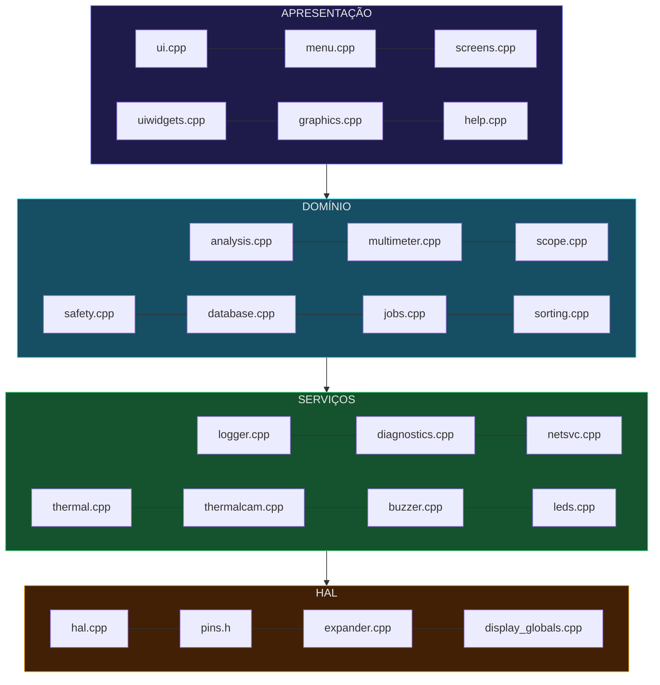
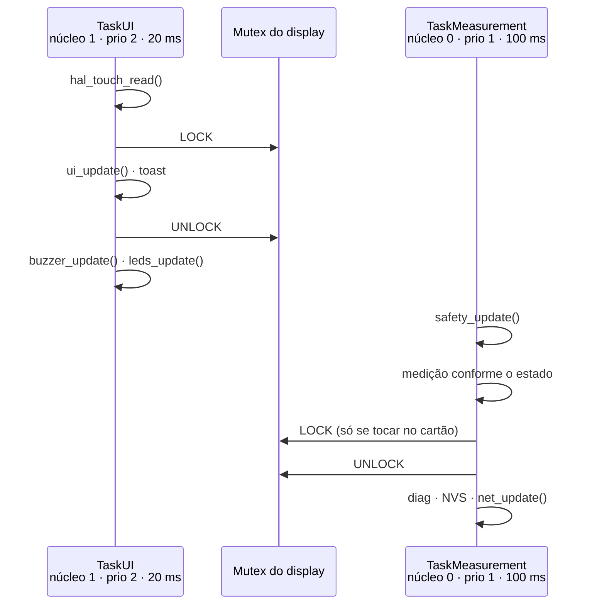

# Guia do desenvolvedor

Arquitetura do firmware Sondvolt v5.1, para quem vai mexer no código.

---

## A restrição que define o projeto

> **A CYD não tem nenhum GPIO livre.** Os 24 pinos utilizáveis do ESP32-WROOM estão todos ocupados.

Antes de propor um recurso que precise de um pino, confirme que ele cabe num dos dois caminhos:

1. **Barramento I²C** — via expansor PCF8574 (8 linhas) ou um chip próprio
2. **Compartilhamento com arbitragem** — `hal_bus_acquire()` / `hal_bus_release()`

Não existe terceira opção nesta placa.

---

## Estrutura de pastas

Desde a v5.1 as camadas são pastas de verdade, não só uma convenção mental:

```
src/
├── config.h  globals.h/.cpp  types.h  main.cpp
├── hal/        pins · hal · expander · display_globals · display_mutex
├── domain/     analysis · multimeter · scope · safety · database
│               calibration · measurements · jobs · sorting
├── services/   logger · diagnostics · netsvc · thermal · thermalcam
│               buzzer · leds
├── ui/         ui · menu · screens · uiwidgets · graphics · help
│               theme · visual · fonts
└── assets/     icons_bitmap · logo_bitmap
```

O PlatformIO compila `src/` recursivamente, mas **não** adiciona os
subdiretórios ao caminho de include. Por isso o `platformio.ini` tem um `-I`
para cada camada — sem eles, `#include "hal.h"` não seria encontrado.

## Estrutura de camadas

A regra é que cada camada só conheça a de baixo.



Nenhum arquivo acima da HAL deve chamar `analogRead()`, `ledcWrite()` ou `digitalWrite()` diretamente em pino compartilhado. Se você precisar disso, a função pertence à HAL.

---

## Por que a HAL existe

Três motivos concretos, todos vindos de bugs reais:

**1. A API do LEDC mudou entre os cores 2.x e 3.x do Arduino-ESP32.** No 2.x é `ledcSetup(canal, freq, bits)` + `ledcAttachPin(pino, canal)`. No 3.x virou `ledcAttach(pino, freq, bits)`. A v3.2 usava as duas APIs em arquivos diferentes — uma delas ia falhar em qualquer core que você escolhesse. `hal_pwm_*()` resolve com `#if ESP_ARDUINO_VERSION_MAJOR`.

**2. Três pinos têm dois donos na Rev A.** Sem arbitragem, acender um LED corrompe a leitura de um sensor. `hal_bus_acquire()` / `hal_bus_release()` garantem exclusão mútua e restauram o estado anterior do pino.

**3. Havia três conversões de coordenada de toque diferentes** — em `main.cpp`, `buttons.cpp` e `safety.cpp`, com constantes e orientações divergentes. Hoje só existe `hal_touch_read()`.

### API da arbitragem

```c
if (hal_bus_acquire(HAL_BUS_ONEWIRE, 300)) {   // timeout em ms
    // o LED rival já foi apagado; o pino é seu
    sensors.requestTemperatures();
    hal_bus_release(HAL_BUS_ONEWIRE);          // LED restaurado ao estado anterior
}
```

Sempre trate o `false`. Um timeout significa que outro subsistema está usando o pino — devolva o último valor conhecido em vez de bloquear a tarefa.

---

## As duas tarefas



Desde a v5.0 as tarefas são fixadas nos núcleos com `xTaskCreatePinnedToCore`: o escalonador não as migra mais no meio de operação sensível a tempo.

**Regra:** a tarefa de interface nunca faz medição lenta, e a tarefa de medição nunca desenha uma tela inteira.

A v3.2 violava as duas: `safety_update()` redesenhava a tela de bloqueio a cada 100 ms a partir da tarefa de medição, e a descarga de capacitor bloqueava por 1,1 segundo com `delay()`.

### Acesso ao display

Um mutex **recursivo** protege o barramento SPI:

```c
LOCK_TFT();
tft.fillRect(...);
UNLOCK_TFT();
```

É recursivo de propósito — funções de desenho chamam outras funções de desenho. Mas cuidado ao chamar um widget de dentro de uma seção travada: os widgets de `uiwidgets.cpp` fazem seu próprio lock. O padrão é liberar antes:

```c
UNLOCK_TFT();
widget_progress_bar(...);
LOCK_TFT();
```

---

## Máquina de estados

`currentAppState` (enum `AppState`, em `types.h`) determina o que a tarefa de medição mede e o que a de interface desenha. É `volatile` porque as duas tarefas leem.

Para adicionar uma tela:

1. Novo valor no enum `AppState`
2. Entrada no array de menu apropriado em `menu.cpp`
3. `case` no `switch` de `ui_update()` chamando sua função de desenho
4. `case` no `switch` de `TaskMeasurement` se a tela precisar de medição contínua
5. Tratamento de toque em `ui_handle_touch()`

---

## Adicionando uma tela de instrumento

Telas novas vão em `screens.cpp` e seguem um contrato de quatro funções:

```c
void screen_X_enter();                      // aloca o que precisar
void screen_X_draw();                       // redesenha
bool screen_X_touch(uint16_t x, uint16_t y); // true se consumiu o toque
void screen_X_exit();                       // LIBERA O HARDWARE
```

**A função de saída não é opcional.** O osciloscópio monopoliza o ADC1 inteiro pelo I²S e o gerador segura o pino de excitação. Esquecer de liberar deixa o resto do aparelho sem conseguir medir nada.

Depois, registre nos quatro `switch` do despacho no fim do arquivo e adicione o estado em `types.h` e o cartão em `menu.cpp`.

---

## Adicionando uma medição

Toda medição nova vai em `analysis.cpp`. O contrato é:

```c
float analysis_measure_alguma_coisa() {
    if (!hal_probe_available()) return 0.0f;                    // 1
    if (!hal_bus_acquire(HAL_BUS_PROBE_DRIVE, 200)) return 0.0f; // 2

    drive_high(PROBE_RANGE_LOW);                                 // 3
    delayMicroseconds(500);
    float v = hal_adc_read_volts(PIN_ADC_PROBE1, 24);
    drive_idle();

    hal_bus_release(HAL_BUS_PROBE_DRIVE);                        // 4

    if (v < LIMIAR_MINIMO) return 0.0f;                          // 5
    return converte(v);
}
```

1. Confirme que o hardware existe. Nunca devolva um número quando não há como medir.
2. Tome o barramento e trate o timeout.
3. Excite, espere estabilizar, leia, volte a alta impedância.
4. **Sempre** libere, inclusive nos caminhos de erro.
5. Rejeite leituras fora da faixa física em vez de propagar lixo.

Depois exponha em `measurements.h` se a interface precisar, e adicione o caso em `analysis_identify()` se entrar na identificação automática.

---

## Banco de dados

Duas fontes, propósitos diferentes:

**Catálogo interno** (`kCatalog` em `database.cpp`) — 53 componentes reais em flash, sempre disponíveis. É o que alimenta `db_judge()`. Para adicionar:

```c
{ "BC547", COMP_TRANSISTOR_NPN, 300, 110, 800, 0.70f, "hFE", "E-B-C",
  "NPN 45V 100mA uso geral" },
//  nominal ─┘   mínimo ─┘  máximo ─┘  param2 ─┘
```

**Cartão SD** (`COMPBD.CSV`) — 5.726 registros consultados por varredura sob demanda. Nunca é carregado inteiro na RAM. Use `db_sd_find()`, `db_sd_find_by_value()` ou `db_sd_find_equivalents()`.

Formato do CSV:

```
nome,tipo,nominal,minimo,maximo,param2,p1,p2,p3,descricao,categoria,flag
```

Os códigos de tipo estão no enum `DbCsvType`.

---

## Persistência

| Namespace NVS | Conteúdo | Módulo |
| :--- | :--- | :--- |
| `sondvolt` | `DeviceSettings` + `UsageStats` | `diagnostics.cpp` |
| `calib` | offsets das pontas | `calibration.cpp` |
| `mmcal` | ganho do ZMPT, escala do INA219, divisor DC | `multimeter.cpp` |
| `net` | SSID e senha do WiFi | `netsvc.cpp` |
| `jobs` | trabalho ativo, para reabrir no boot | `jobs.cpp` |

As configurações usam número mágico (`0x53564C54`) e versão de formato (`kSettingsVersion`). **Ao alterar o layout de `DeviceSettings`, incremente a versão** — assim uma gravação antiga é descartada em vez de lida errado.

A gravação é adiada 8 segundos por `settings_mark_dirty()` / `settings_flush_if_needed()`, para não escrever na flash a cada toque na tela.

---

## Compilando

```bash
pio run                    # Rev A
pio run -e cyd-revb        # Rev B
pio run -t upload
pio device monitor
```

O `-w` foi removido do `platformio.ini`. O projeto compila **sem nenhum aviso** com `-Wall -Wextra` nas duas revisões. Se a sua alteração gerar um aviso, ele é real — a flag `-w` da v3.2 escondia macros redefinidas com valores conflitantes.

### Verificação sem hardware

Não é preciso ter a placa para validar sintaxe, tipos e símbolos. Um harness de compilação no host com stubs das bibliotecas Arduino compila e **linka** todas as unidades de tradução, o que pega a grande maioria dos erros antes do upload.

---

## Sistema de design

`ui/theme.h` é o dono único da aparência. Nenhuma tela deve escolher a própria
cor ou margem.

```c
// Superfícies, do fundo para a frente
th_bg0   fundo da tela
th_bg1   cartão
th_bg2   cartão elevado
th_bg3   borda e divisória

// Texto, do mais para o menos contrastado
th_txHi  th_txMd  th_txLo  th_txDim

// Acento escolhido pelo usuário
th_accent  th_accentDim

// Semântica fixa, igual em toda a interface
TH_SUCCESS  TH_WARNING  TH_DANGER  TH_INFO  TH_SPECIAL
```

Espaçamento sai da escala `TH_SP_1` a `TH_SP_6` (múltiplos de 4). Raio de canto
tem três valores, não cinco: em 320×240 a diferença entre 5 e 6 não existe.

Para desenhar, use os componentes prontos em `uiwidgets.h` — `ui_card`,
`ui_button`, `ui_chip`, `ui_section`, `ui_header`, `ui_big_value`. Desenhar
retângulo à mão é o que fazia a interface parecer montada por pessoas
diferentes.

`th_on(fundo)` calcula a cor de texto legível sobre qualquer fundo pela
luminância percebida. Use em vez de chutar preto ou branco.

---

## Convenções

**Nomes.** `modulo_acao()` para funções públicas (`analysis_measure_esr`), `snake_case` estático para internas, `gNome` para estado global de arquivo, `kNome` para constantes.

**Comentários.** Explique *por quê*, não *o quê*. `// incrementa i` não ajuda ninguém; `// A ordem importa: o primeiro ramo capturava tudo acima de 50 V` evita que alguém reintroduza o bug.

**Acentuação.** O código-fonte usa ASCII puro nos comentários. A documentação em Markdown usa português com acentos normalmente.

**Buffers.** `snprintf()` sempre, `sprintf()` nunca. Cheque o tamanho do destino.

**Ponto flutuante.** `float` no ESP32 tem unidade em hardware; `double` é emulado e lento. Use `double` só onde a precisão exige — a soma de quadrados do RMS, por exemplo, onde 256 amostras de 2048² passam de 1e9.

---

## Onde estão as coisas

| Preciso mexer em... | Arquivo |
| :--- | :--- |
| aparência: cor, espaçamento, fonte | `ui/theme.h` |
| linhas de controle da placa Bancada | `hal/expander.cpp` |
| osciloscópio, curva, ripple, gerador, Zener | `scope.cpp` |
| trabalhos por cliente | `jobs.cpp` |
| pareamento de peças | `sorting.cpp` |
| WiFi, página web, OTA, relógio | `netsvc.cpp` |
| câmera térmica | `thermalcam.cpp` |
| telas dos instrumentos novos | `screens.cpp` |
| pinagem | `pins.h` |
| constante de medição, cor, tempo | `config.h` |
| algoritmo de medição | `analysis.cpp` |
| multímetro, ZMPT, INA219 | `multimeter.cpp` |
| proteção elétrica | `safety.cpp` |
| catálogo de componentes | `database.cpp` |
| tela | `ui.cpp` |
| menu | `menu.cpp` |
| widget reutilizável | `uiwidgets.cpp` |
| autoteste, saúde, NVS | `diagnostics.cpp` |
| acesso a pino, PWM, ADC, toque | `hal.cpp` |
