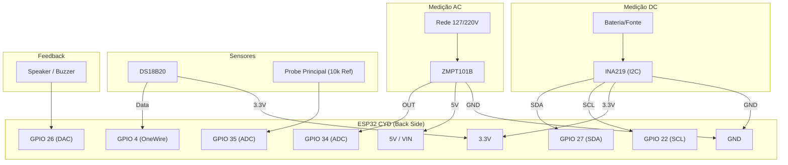

# 🏗️ Guia de Hardware — Component Tester PRO v3.0

O hardware do **Component Tester PRO** foi projetado para ser modular, utilizando a placa **ESP32-2432S028R (CYD)** como unidade central de processamento e interface.

  

---

## 1. Componentes Principais

Abaixo, detalhamos cada componente do ecossistema, sua função e como ele se integra ao sistema.

### 🖥️ ESP32-2432S028R (Cheap Yellow Display)
- **O que é:** Uma placa de desenvolvimento "tudo-em-um" com ESP32, display TFT 2.8" e touchscreen.
- **Função:** Processa as medições, renderiza a interface gráfica e gerencia o armazenamento no SD.
- **Ligação:** Alimentada via Micro USB (5V). Expõe pinos de IO nos conectores traseiros (CN1, P3, etc).

### ⚡ Sensor ZMPT101B (AC Voltage)
- **O que é:** Um transformador de tensão isolado com amplificador operacional.
- **Função:** Permite medir a tensão da rede elétrica (110V/220V) com segurança.
- **Ligação:** 
  - **L/N:** Conectado à rede AC.
  - **VCC/GND:** 5V/GND da CYD.
  - **OUT:** Conectado ao **GPIO 34** (Entrada analógica).

### 🔌 Sensor INA219 (DC Monitor)
- **O que é:** Sensor de corrente e tensão via barramento I2C.
- **Função:** Mede consumo de dispositivos DC, baterias e fontes.
- **Ligação:**
  - **VCC/GND:** 3.3V/GND da CYD.
  - **SDA/SCL:** Conectado aos **GPIO 27** e **GPIO 22**.
  - **Vin+/Vin-:** Em série com a carga que deseja medir.

### 🌡️ Sonda DS18B20
- **O que é:** Sensor de temperatura digital à prova d'água.
- **Função:** Monitora a temperatura de componentes ou ambientes.
- **Ligação:**
  - **VCC/GND:** 3.3V/GND.
  - **DATA:** Conectado ao **GPIO 4**.
  - **Pull-up:** Requer um resistor de **4.7kΩ** entre DATA e VCC.

---

## 🗺️ Diagrama de Ligação Completo

O gráfico abaixo ilustra como todos os módulos externos se conectam aos pinos da placa CYD.

---

## 📍 Pinagem de Referência (CYD)

Para facilitar a montagem, utilize a tabela abaixo para localizar os pinos nos conectores da placa:

| Pino CYD | Função Interna | Uso no Projeto | Conector Sugerido |
|:---:|:---|:---|:---|
| **GPIO 34** | ADC1_CH6 | Entrada ZMPT101B (AC) | CN1 / P3 |
| **GPIO 35** | ADC1_CH7 | Probe Principal (Componentes) | CN1 / P3 |
| **GPIO 27** | I2C SDA | SDA (INA219 / OLED / Sensores) | P3 |
| **GPIO 22** | I2C SCL | SCL (INA219 / OLED / Sensores) | P3 |
| **GPIO 4**  | OneWire | Sonda Térmica DS18B20 | P3 |
| **GPIO 26** | DAC/LEDC | Buzzer / Speaker Externo | Speaker Conn |
| **GPIO 21** | Backlight | Controle de Brilho (Interno) | - |

---

## ⚡ Especificações Elétricas

> [!CAUTION]
> **Atenção:** Os pinos do ESP32 operam em **3.3V**. Nunca aplique tensões superiores diretamente nos pinos de IO. Use sempre os módulos de isolação (ZMPT) ou divisores de tensão adequados.

- **Alimentação Sugerida:** Fonte USB de 5V / 2A.
- **Consumo:** ~150mA (repouso) / ~250mA (medição ativa com brilho máximo).
- **Proteção:** Recomenda-se o uso de fusíveis de 100mA na entrada do sensor ZMPT101B.

---

## 📝 Lista de Materiais (BOM)

1. **Placa:** ESP32-2432S028R (Cheap Yellow Display).
2. **AC Sensor:** Módulo ZMPT101B (Azul).
3. **DC Sensor:** Módulo INA219 (I2C).
4. **Temperatura:** Sonda DS18B20 (Waterproof).
5. **Resistores:** 1x 4.7kΩ (Pull-up), 1x 10kΩ (Referência ADC).
6. **Cartão SD:** MicroSD 8GB+ (Formatado em FAT32).