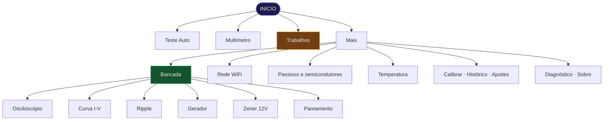

# Mapa de telas

Navegação por toque. O botão de voltar fica sempre no canto superior esquerdo; o de ajuda contextual, no superior direito das telas de medição.

---

## Estrutura



```
INÍCIO (4 cartões)
├── Teste Auto ......... identificação automática
├── Multímetro ......... AC/DC, corrente, resistência, continuidade, potência
├── Trabalhos .......... organiza medições por cliente
└── Mais ............... submenu com 16 opções
    │
    ├── Bancada ........ submenu dos instrumentos (Rev C)
    │   ├── Osciloscópio ..... 200 kSPS, gatilho, atenuador
    │   ├── Curva I-V ........ traçador de característica
    │   ├── Ripple ........... ondulação sobre trilho DC
    │   ├── Gerador .......... onda quadrada 1 Hz a 100 kHz
    │   ├── Zener 12V ........ joelho de 2 a 11 V
    │   └── Pareamento ....... casa peças por proximidade
    ├── Rede WiFi ...... conexão, página web, OTA, relógio
    │
    ├── Resistor ....... ohmímetro com código de cores e série E24
    ├── Capacitor ...... capacímetro com ESR e botão de descarga
    ├── Diodo .......... tensão direta e família (Schottky / silício)
    ├── LED ............ tensão direta e cor estimada
    ├── Transistor ..... hFE, Vbe e tipo
    ├── Indutor ........ indutância e resistência DC
    ├── CI / IC ........ análise genérica
    ├── Scanner ........ varredura contínua
    ├── Temperatura .... submenu
    │   ├── Termômetro de contato (DS18B20)
    │   └── Câmera térmica (reservado para o MLX90640)
    ├── Calibrar ....... rotina guiada de calibração das pontas
    ├── Histórico ...... últimas medições gravadas no cartão
    ├── Ajustes ........ preferências
    ├── Diagnóstico .... autoteste e saúde do sistema
    └── Sobre .......... versão e informações do sistema
```

---

## Telas de medição

Todas seguem o mesmo layout:

```
┌────────────────────────────────────────────────┐
│ ←  TÍTULO DA TELA                          ?   │  cabeçalho
├──────────┬─────────────────────────────────────┤
│          │                                     │
│  ícone   │            4.70 k                   │  valor grande,
│    do    │                             Ohm     │  fonte adaptativa
│ componen.│                                     │
├──────────┴─────────────────────────────────────┤
│  E24: 4.70 kOhm (+0.0%)                        │  informação
│  Tolerancia sugerida: 1%                       │  secundária
├────────────────────────────────────────────────┤
│  [ ação ]              ▮▮▮▮ faixas de cor      │  ações e extras
├────────────────────────────────────────────────┤
│ ● SD   FIRMWARE V5.0   09/05 14:32        ▮▮   │  barra de status
└────────────────────────────────────────────────┘
```

O tamanho da fonte do valor se ajusta ao comprimento do texto, do tamanho 5 ao 1, para nunca estourar o painel.

**O que não pode ser medido aparece como `---` com o motivo ao lado.** Nas versões anteriores essas telas exibiam valores fixos (`ESR: 0.12 Ohms`, `hFE: 245`) como se fossem medições reais.

---

## Início

Quatro cartões grandes e uma faixa de **Recentes** com os seis últimos componentes testados. Tocar num recente abre direto a tela correspondente.

Toque uma vez para selecionar, toque de novo para entrar — evita entrar por engano ao encostar na tela.

---

## Multímetro

Tocar no valor ou na área inferior cicla entre os seis modos:

| Modo | Requer | Faixa |
| :--- | :--- | :--- |
| Tensão DC | — (melhor com INA219) | 0 a 26 V |
| Tensão AC | ZMPT101B | 0 a 250 V RMS |
| Corrente DC | INA219 | ±3,2 A |
| Resistência | circuito de pontas | 0,5 Ω a 2 MΩ |
| Continuidade | circuito de pontas | apito abaixo de 10 Ω |
| Potência | INA219 | calculada |

No modo AC a tela mostra RMS e pico simultaneamente, e sinaliza `SURTO!` quando o pico passa de 1,75 vez o RMS — indicativo de transitório ou forma de onda muito distorcida.

Modos que dependem de um sensor ausente mostram "indisponível" em vez de zero.

> Entrar no modo multímetro exige confirmar, na tela, que o fusível, o varistor e o TVS estão instalados.

---

## Diagnóstico

Duas colunas:

**Autoteste** — os 10 subsistemas com resultado OK, AVISO, FALHA ou AUSENTE:
display, touchscreen, cartão SD, pontas de prova, sensor térmico, sensor de corrente, sensor AC, buzzer, LEDs, PSRAM.

**Sistema** — modelo e revisão do chip, frequência, flash, heap livre e mínimo histórico, folga da pilha das duas tarefas, tempo ligado e total de medições.

Embaixo, uma barra com o uso de RAM, que fica vermelha quando o heap cai abaixo do limite seguro.

Esta é a primeira tela a consultar quando algo não funciona.

---

## Calibração

Rotina guiada em duas etapas, com instruções na tela:

1. **Encoste as pontas uma na outra** — mede a resistência dos cabos (12 amostras)
2. **Afaste as pontas** — mede a capacitância parasita (8 amostras)

Leva cerca de 15 segundos. Os offsets são validados antes de gravar: valores fisicamente impossíveis são rejeitados e a calibração anterior é restaurada. Ficam gravados na NVS com checksum.

> Nas versões anteriores o botão CALIBRAR apenas copiava a última leitura para os offsets, gravando como "erro das pontas" o valor do componente que estivesse conectado.

---

## Histórico

Últimas medições lidas do `MEASURE.CSV` do cartão. Cada linha traz componente, valor, unidade e status. O botão de limpar apaga o arquivo e recria o cabeçalho.

O arquivo rotaciona automaticamente em 256 KB, renomeando para `MEASURE.OLD`.

---

## Ajustes

Brilho · sons · modo silencioso · desligamento automático · unidades · tema · modo noturno · animações · salvar histórico · confirmar ações · modo avançado · idioma · bipe forte · restaurar padrões.

As alterações são gravadas na NVS com atraso de 8 segundos, para não desgastar a flash a cada toque.

---

## Gestos

| Gesto | Efeito |
| :--- | :--- |
| Toque | seleciona; segundo toque no mesmo item confirma |
| Deslizar para os lados | troca de página no menu |
| Deslizar para cima/baixo | rola listas e ajustes |
| Toque no canto superior esquerdo | volta |
| Toque no canto superior direito | ajuda contextual da tela |

---

## Sobreposições

Aparecem por cima de qualquer tela:

**Alerta de alta tensão** — tela cheia vermelha quando o sistema de segurança detecta tensão perigosa. Só sai quando o usuário confirma. *(Existia desde a v3.1 mas nunca era exibida.)*

**Bloqueio de segurança** — contagem regressiva de 10 segundos após três detecções perigosas seguidas.

**Descarga de capacitor** — barra de progresso acompanhando a tensão real caindo, não um tempo fixo.

**Notificações** — faixa colorida no rodapé que some sozinha, para confirmações e avisos que não merecem interromper o trabalho.
