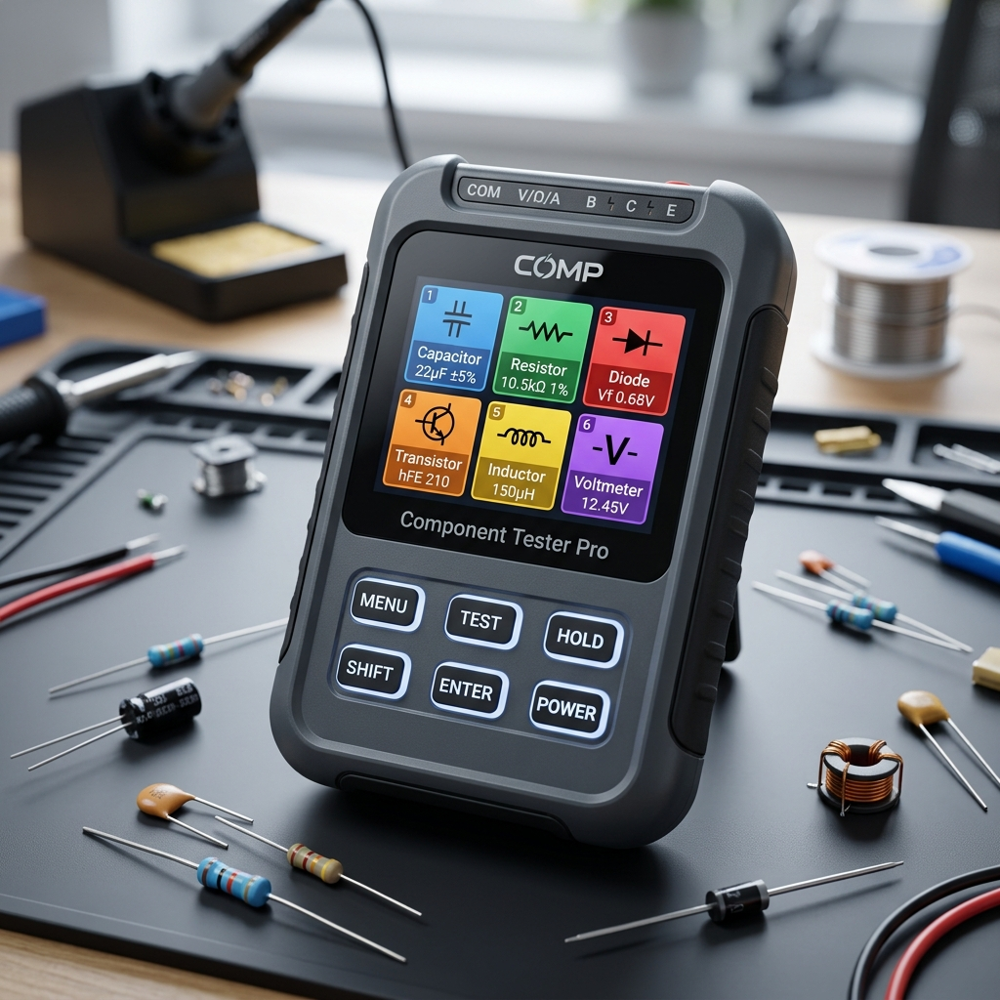

# 🚀 Roadmap — Sondvolt v3.2

  

Este documento apresenta o planejamento de funcionalidades futuras para o **Sondvolt v3.2**. As ideias estão organizadas por categoria e priorizadas conforme viabilidade técnica e demanda da comunidade.

---

## 🎯 Visão de Longo Prazo

O Sondvolt visa se tornar uma estação de teste completa e conectada. O objetivo é transformar o dispositivo de uma ferramenta de bancada isolada em um verdadeiro hub de diagnóstico IoT, com conectividade WiFi, Bluetooth, e integração com aplicativos móveis e serviços cloud.

> 💡 **Nota:** Este roadmap é dinâmico e pode mudar conforme feedback da comunidade e avanços tecnológicos. Funcionalidades com ✅ já estão em desenvolvimento ou implementadas.

---

## 📋 Funcionalidades Futuras por Categoria

### 1. 🌐 Conectividade e IoT

| # | Funcionalidade | Descrição | Prioridade | Status |
|:-|:---|:---|:---:|:---:|
| 1.1 | **WiFi Client Mode** | Conecta o CYD a redes WiFi existentes para sincronização de dados | 🔴 Alta | 📋 Planejado |
| 1.2 | **Web Server Embarcado** | Servidor web interno para acesso via navegador (sem necessidade de app) | 🔴 Alta | 📋 Planejado |
| 1.3 | **OTA Atualizações** | Atualização de firmware via WiFi (Over-The-Air) | 🔴 Alta | ✅ Em Desenvolvimento |
| 1.4 | **MQTT Client** | Publicação de medições em broker MQTT para automação residencial | 🟡 Média | 📋 Planejado |
| 1.5 | **NTP Sync** | Sincronização automática de data/hora via NTP | 🟡 Média | 📋 Planejado |
| 1.6 | **REST API** | Endpoints REST para integração com sistemas externos | 🟡 Média | 📋 Planejado |

### 2. 📱 Interface e App Móvel

| # | Funcionalidade | Descrição | Prioridade | Status |
|:-|:---|:---|:---:|:---:|
| 2.1 | **Web App** | Interface web responsiva para controle total via navegador | 🔴 Alta | 📋 Planejado |
| 2.2 | **PWA Support** | Progressive Web App para instalação em Android/iOS | 🔴 Alta | 📋 Planejado |
| 2.3 | **Dashboard IoT** | Visualização em tempo real de todas as medições | 🔴 Alta | 📋 Planejado |
| 2.4 | **Notificações Push** | Alertas via web push para eventos críticos | 🟢 Baixa | 💡 Ideia |
| 2.5 | **App Nativo (Opcional)** | Aplicativo dedicado para iOS/Android (depende de demanda) | 🟢 Baixa | 💡 Ideia |

### 3. 📡 Comunicação Sem Fio

| # | Funcionalidade | Descrição | Prioridade | Status |
|:-|:---|:---|:---:|:---:|
| 3.1 | **Bluetooth Classic** | Comunicação BLE com dispositivos móveis | 🟡 Média | 📋 Planejado |
| 3.2 | **Bluetooth LE (BLE)** | Modo de baixo consumo para sensor remoto | 🟡 Média | 💡 Ideia |
| 3.3 | **IR Remote Control** | Controle do dispositivo por controle remoto IR | 🟢 Baixa | 💡 Ideia |

### 4. 📊 Modos de Medição Avançados

| # | Funcionalidade | Descrição | Prioridade | Status |
|:-|:---|:---|:---:|:---:|
| 4.1 | **Teste de LED Automático** | Identificação automática de cor de LED | 🔴 Alta | 📝 Em Estudo |

---

## Visão de Longo Prazo

O Component Tester PRO visa se tornar uma estação de teste completa e conectad a. O objetivo é transformar o dispositivo de uma ferramenta de bancada isolada em um verdadeirohub de diagnóstico IoT, com conectividade WiFi, Bluetooth, e integração com aplicativos móviles e serviços cloud.

> **Nota:** Este roadmap é dinámico e pode mudar conforme feedback da comunidade e avanços tecnológicos. Funcionalidades com ✓ já estão em desenvolvimento ou implementadas.

---

## Funcionalidades Futuras por Categoria

### 1. Conectividade e IoT

| # | Funcionalidade | Descrição | Prioridade | Status |
|:-|:---|:---|:---|:---|
| 1.1 | **WiFi Client Mode** | Conecta o CYD a redes WiFi existentes para sincronização de dados | Alta | Planejado |
| 1.2 | **Web Server Embarcado** | Servidor web interno para acesso via navegador (sem necessidade de app) | Alta | Planejado |
| 1.3 | **OTA Atualizações** | Atualização de firmware via WiFi (Over-The-Air) | Alta | ✓ Em Desenvolvimento |
| 1.4 | **MQTT Client** | Publicação de medições em broker MQTT para automação residencial | Média | Planejado |
| 1.5 | **NTP Sync** | Sincronização automática de data/hora via NTP | Média | Planejado |
| 1.6 | **REST API** | Endpoints REST para integração com sistemas externos | Média | Planejado |

### 2. Interface e App Móvel

| # | Funcionalidade | Descrição | Prioridade | Status |
|:-|:---|:---|:---|:---|
| 2.1 | **Web App** | Interface web responsiva para controle total via navegador | Alta | Planejado |
| 2.2 | **PWA Support** | Progressive Web App para instalação em Android/iOS | Alta | Planejado |
| 2.3 | **Dashboard IoT** | Visualização em tempo real de todas as medições | Alta | Planejado |
| 2.4 | **Notificações Push** | Alertas via web push para eventos críticos | Baixa | Ideia |
| 2.5 | **App Nativo (Opcional)** | Aplicativo dedicado para iOS/Android (depende de demanda) | Baixa | Ideia |

### 3. Comunicação Sem Fio

| # | Funcionalidade | Descrição | Prioridade | Status |
|:-|:---|:---|:---|:---|
| 3.1 | **Bluetooth Classic** | Comunicação BLE com dispositivos móveis | Média | ✓ Planejado |
| 3.2 | **Bluetooth LE (BLE)** | Modo de baixo consumo para sensor remoto | Média | Ideia |
| 3.3 | **IR Remote Control** | Controle do dispositivo por controle remoto IR | Baixa | Ideia |

### 4. Modos de Medição Avançados

| # | Funcionalidade | Descrição | Prioridade | Status |
|:-|:---|:---|:---|:---|
| 4.1 | **Teste de LED Automático** | Identificação automática de cor de LED | Alta | Em Estudo |
| 4.2 | **Medição de ESR** | Teste de Resistência Série em capacitores | Alta | Em Estudo |
| 4.3 | **Teste de Capacitor Eletrolítico** | Verificação de ESR e vazamento | Alta | Em Estudo |
| 4.4 | **Teste de Saúde de Bateria** | Curvas de carga/descarga, capacidade mAh e SoH | Alta | 📋 Planejado |
| 4.5 | **Analista de Células Li-ion** | Teste específico para 18650 com medição de resistência interna | Alta | 📋 Planejado |
| 4.6 | **Teste de MOSFET** | Curva característica Vgs vs Id | Média | 💡 Ideia |
| 4.7 | **Teste de Bobinas/Indutores** | Medição de indutância e resistência DC | Média | 💡 Ideia |
| 4.8 | **Medição de Frequência** |Contador de frequência via GPIO | Média | 💡 Ideia |
| 4.9 | **Teste de cristal XTAL** | Teste de cristais e ressonadores | Baixa | 💡 Ideia |
| 4.10 | **Gerador de Sinais** | Gerador de waveforms (sine, square, PWM) | Baixa | 💡 Ideia |
| 4.11 | **Teste de LEDs de 7 segmentos** | Decodificação automática | Baixa | 💡 Ideia |

### 5. Armazenamento e Dados

| # | Funcionalidade | Descrição | Prioridade | Status |
|:-|:---|:---|:---|:---|
| 5.1 | **Banco de Dados JSON** | Migrar de CSV para JSON (melhor performance) | Alta | Em Estudo |
| 5.2 | **Exportação CSV/JSON** | Exportar medições em múltiplos formatos | Alta | Planejado |
| 5.3 | **Histórico Ilimitado** | Armazenamento circular no SD com rotação | Média | Planejado |
| 5.4 | **Cloud Sync** | Sincronização automática com Google Drive/Dropbox | Baixa | Ideia |
| 5.5 | **Relatórios PDF** | Geração de relatórios de medições | Baixa | Ideia |

### 6. Calibração e Precisão

| # | Funcionalidade | Descrição | Prioridade | Status |
|:-|:---|:---|:---|:---|
| 6.1 | **Calibração Automática** | Calibração com um clique usando参考 padrão | Alta | Planejado |
| 6.2 | **Compensação de Temperatura** | Ajuste fino baseado na temperatura ambiente | Média | Em Estudo |
| 6.3 | **Curva de Calibração** | Curva polinomial para sensores não-lineares | Média | Ideia |
| 6.4 | **Perfil de Calibração** | Multiplos perfis (ex: para diferentes ZMPT101B) | Baixa | Ideia |

### 7. Interface Gráfica

| # | Funcionalidade | Descrição | Prioridade | Status |
|:-|:---|:---|:---|:---|
| 7.1 | **Dark/Light Theme** | Alternância entre temas escuro/claro | Alta | Ideia |
| 7.2 | **Gráficos em Tempo Real** | Gráficos de tensão/corrente em tempo real | Alta | Planejado |
| 7.3 | **Animações de Teste** | Visualização animada do processo de medição | Média | Ideia |
| 7.4 | ** Ícones Customizáveis** | Pack de ícones alternativos | Baixa | Ideia |
| 7.5 | **Skins de Interface** | Temas visuais completos | Baixa | Ideia |

### 8. Hardware Expansível

| # | Funcionalidade | Descrição | Prioridade | Status |
|:-|:---|:---|:---|:---|
| 8.1 | **Shield de Expansão Pro** | PCB shield com soquete ZIF e bornes de engate rápido | Alta | 📋 Planejado |
| 8.2 | **Soquete ZIF Integrado** | Soquete de 14/20 pinos para teste rápido de componentes | Alta | 📋 Planejado |
| 8.3 | **Sistema de Sockets Removíveis**| Conectores intercambiáveis para baterias AA, AAA e 18650 | Alta | 📋 Planejado |
| 8.4 | **Módulo de Bateria 2S** | Alimentação via 2x 18650 com Buck Converter 5V e BMS | Alta | 📋 Planejado |
| 8.5 | **Suporte a Displays Maiores** | Compatibilidade com displays de 3.5" e 4" | Média | 💡 Ideia |
| 8.6 | **Sonda de Corrente AC** | Support para pinça amperimétrica | Média | 💡 Ideia |
| 8.7 | **RTC Externo** | Módulo RTC com backup de bateria | Baixa | 💡 Ideia |

### 9. Integração e Automação

| # | Funcionalidade | Descrição | Prioridade | Status |
|:-|:---|:---|:---|:---|
| 9.1 | **Home Assistant** | Integração nativa com Home Assistant | Alta | Planejado |
| 9.2 | **IFTTT Triggers** | Ações automáticas baseadas em medições | Média | Ideia |
| 9.3 | **Node-RED** | Integração com Node-RED | Média | Ideia |
| 9.4 | **Alexa/Google Assistant** | Comandos de voz para executar medições | Baixa | Ideia |

### 10. Inteligência Artificial

| # | Funcionalidade | Descrição | Prioridade | Status |
|:-|:---|:---|:---|:---|
| 10.1 | **Identificação por ML** | Identificação de componentes via Machine Learning | Alta | Em Pesquisa |
| 10.2 | **Previsão de Falha** | Análise preditiva de componentes | Baixa | Ideia |
| 10.3 | **Classificação Automática** | Auto-classificação de componentes ruins/bons | Média | Ideia |

---

## Mapa de Versões Futuras

### Versão 3.1 — "Connect Edition" (Q3 2026)

**Foco:** Conectividade WiFi e IoT básico

- [ ] Web Server embarcado
- [ ] OTA Updates
- [ ] Dashboard IoT via browser
- [ ] Sincronização NTP

### Versão 3.2 — "Safety & Precision Edition" (Abril 2026) ✅

**Foco:** Segurança AC 220V e Precisão True RMS

- [x] Motor de Cálculo True RMS (128 amostras)
- [x] Sistema de Segurança Ativa (>50V Lockout)
- [x] Detecção de Pico e Surtos [SURGE!]
- [x] Circuito de Proteção Mandatório (Fusível/Varistor/TVS)
- [x] Auditoria de Materiais (BOM Audit)

### Versão 3.3 — "Pro Edition" (Q1 2027)

**Foco:** Modos de medição avançados

- [ ] Teste de bateria (curva de carga)
- [ ] Medição de ESR
- [ ] Teste de LED automático
- [ ] Calibração automática

### Versão 4.0 — "Ultimate Edition" (Q2 2027)

**Foco:** Integração completa e IA

- [ ] Home Assistant nativo
- [ ] Identificação por ML
- [ ] Cloud sync
- [ ] Shield de expansão oficial

---

## Como Contribuir com Ideias

Tem uma sugestão para o roadmap? Existem várias formas de contribuir:

1. **Abrir uma Issue** no GitHub com a tag `feature-request`
2. **Discutir no fórum** da comunidade
3. **Enviar um Pull Request** com implementação
4. **Doar** para acelerar desenvolvimento

Consulte o arquivo [CONTRIBUTING.md](CONTRIBUTING.md) para detalhes sobre como contribuir.

---

## Histórico de Versões

| Versão | Data | Alterações |
|:---|:---|:---|
| 1.0.0 | Abril 2026 | Versão inicial do roadmap |

---

<i>Última atualização: Abril de 2026 — Component Tester PRO Team</i>

