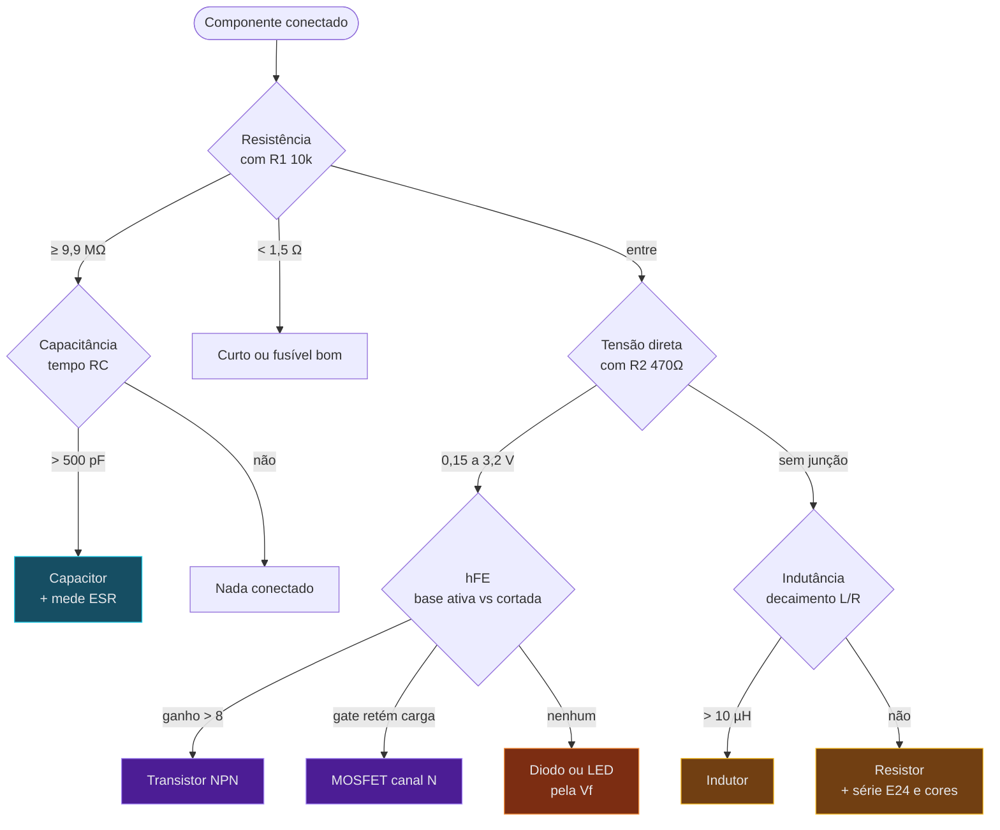
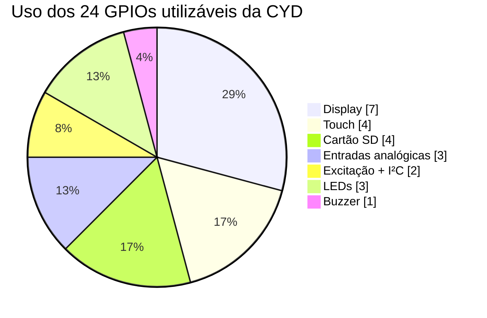
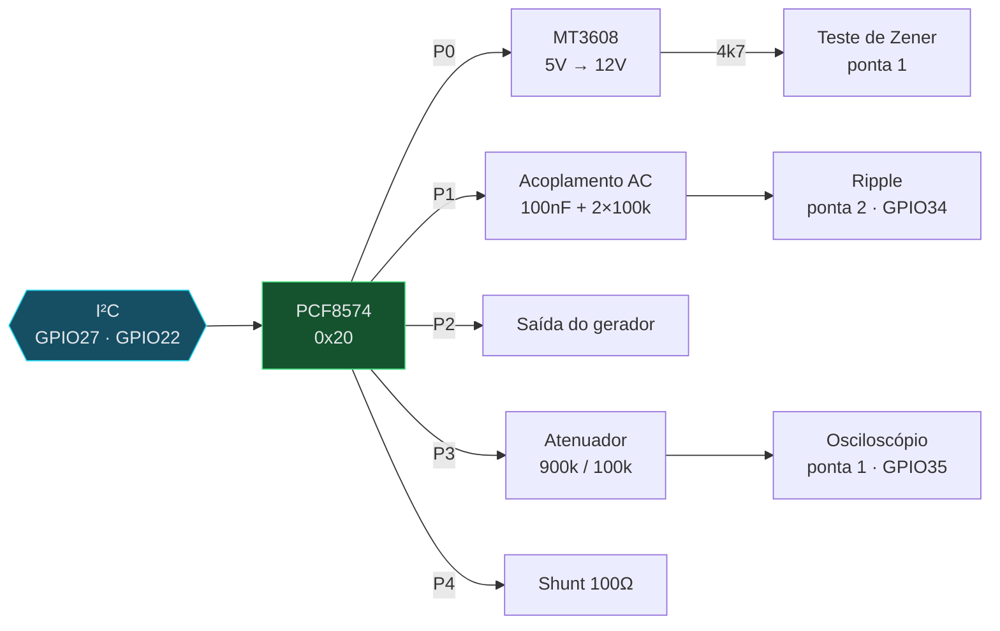

# Esquema de ligação

Onde plugar, onde soldar e por quê. Comece pela seção 1 — sem ela o aparelho não mede nada.

- [1. Circuito de excitação](#1-circuito-de-excitação) — **obrigatório**
- [2. Placa de expansão "Bancada"](#2-placa-de-expansão-bancada)
- [3. Sensor de tensão AC](#3-sensor-de-tensão-ac)
- [4. Sensor de corrente](#4-sensor-de-corrente)
- [5. Sonda térmica](#5-sonda-térmica)
- [6. Câmera térmica](#6-câmera-térmica)
- [7. Conectores da CYD](#7-conectores-da-cyd)
- [8. Checklist](#8-checklist)

---

## 1. Circuito de excitação

### Por que existe

As pontas de prova estão em GPIO34 e GPIO35. Esses pinos do ESP32 são **entrada apenas** — não conseguem aplicar tensão em nada. Para medir um componente passivo é preciso injetar corrente conhecida e observar a queda, e essa injeção precisa vir de um pino com driver de saída.

A v3.2 tentava fazer isso direto pelo GPIO35 e a chamada simplesmente não surtia efeito.

### Esquema

```
                    +3V3
                     │
         GPIO27 ─────┤  drive faixa alta
        (saída)      │
                   ┌─┴─┐
                   │10k│ R1  1%   ← referência de 1 kΩ a 2 MΩ
                   └─┬─┘
                     │
         GPIO22 ─────┤  drive faixa baixa
        (saída)      │
                   ┌─┴─┐
                   │470│ R2  1%   ← referência de 0,5 Ω a 2 kΩ
                   └─┬─┘
                     │
    ┌────────────────┼──────────────────────► PONTA 1  (banana vermelho)
    │                │
 GPIO35              │
(leitura)       COMPONENTE
                     │
    ┌────────────────┼──────────────────────► PONTA 2  (banana preto)
    │                │
 GPIO34         ┌────┴────┐
(leitura)       │   Q1    │  2N7000
                │  dreno  │
    GPIO17 ─────┤  gate   │
   (descarga)   │  fonte  │
                └────┬────┘
                     │
                  ┌──┴──┐
                  │100k │  pull-down do gate
                  └──┬──┘
                     │
                    GND
```

### Fluxo de decisão de cada medição



### Como o firmware usa cada caminho

| Medição | Caminho | Fórmula |
|:--|:--|:--|
| Resistência | drive alto, lê a queda | `Rx = Rref × V / (Vcc − V)` |
| Capacitância | descarrega, carrega, cronometra até 63,2% | `C = t / R` |
| ESR | pulso de 25 µs, leitura única sem média | `ESR = 470 × V / (Vcc − V)` |
| Tensão direta | R2 dá ~5 mA, lê a ponta | leitura direta |
| hFE | base por R1, coletor por R2 | `Ic / Ib` |
| Indutância | degrau, mede queda a 37% | `L = τ × R` |

### Peças

| Ref | Valor | Observação |
|:--|:--|:--|
| R1 | 10 kΩ **1%** | define a precisão acima de 2 kΩ |
| R2 | 470 Ω **1%** | define a precisão abaixo de 2 kΩ |
| R3 | 100 kΩ | pull-down do gate de Q1 |
| Q1 | 2N7000 ou BS170 | descarga de capacitor |

> [!TIP]
> Use resistores de **1% ou melhor**. Um de 5% no lugar de R1 limita todas as medições a 5% de erro, por melhor que seja o firmware. A economia é de 20 centavos.

### Como o firmware verifica

No boot, alterna `PIN_PROBE_DRIVE` entre alto e baixo e confere se a leitura da ponta 1 acompanha. Diferença menor que 500 contas de ADC significa divisor ausente — e as medições de componente ficam desativadas em vez de devolver número inventado.

Confira em `Mais > Diagnóstico`, linha **Pontas de prova**.

---

## 2. Placa de expansão "Bancada"

> Necessária para osciloscópio com atenuador, curva I-V, ripple, gerador e Zener acima de 3,3 V. Compile com `-e cyd-revc`.

### Por que um expansor



Zero pinos livres. O PCF8574 dá 8 linhas de controle a custo de nenhum GPIO, porque entra pelo I²C que já existe.

### Ligação do expansor

```
   PCF8574 (DIP-16)
   ┌──────────────┐
 A0┤1           16├ VCC ── +3V3
 A1┤2           15├ SCL ── GPIO22
 A2┤3           14├ SDA ── GPIO27
 P0┤4           13├ P7
 P1┤5           12├ P6
 P2┤6           11├ P5
 P3┤7           10├ P4
GND┤8            9├ INT  (não usado)
   └──────────────┘

 A0, A1, A2 em GND  →  endereço 0x20
```

### Mapa das linhas

| Linha | Função | Aciona |
|:--|:--|:--|
| P0 | Habilita a fonte de 12 V | EN do MT3608, via 2N7000 |
| P1 | Insere o capacitor de acoplamento AC | JFET ou relé de sinal |
| P2 | Conecta a saída do gerador na ponta 1 | 2N7000 |
| P3 | Seleciona o atenuador 1x / 10x | relé de sinal |
| P4 | Insere o shunt de 100 Ω do traçador | 2N7000 |
| P5 | Isola as pontas durante medição de rede | relé |
| P6, P7 | Reserva | — |

> [!WARNING]
> As saídas do PCF8574 são **dreno aberto** com pull-up interno fraco (~100 µA). Elas puxam bem para baixo e são fracas para cima.
>
> - Acionar transistor: **OK**
> - Alimentar relé ou LED direto: **não**, use um transistor
> - Entrada lógica de outro CI: OK, com pull-up externo de 10 kΩ

### Blocos da placa



### 2.1 Fonte auxiliar de 12 V

```
  +5V ──► [MT3608] ──► +12V ──[ 4k7 ]──► PONTA 1
            │                              │
           EN                            ZENER (reverso)
            │                              │
    P0 ──[2N7000]                         GND
```

Ajuste o trimpot do MT3608 para **12,0 V** antes de ligar na ponta. O resistor de 4,7 kΩ limita a corrente de teste a ~2 mA, valor típico de folha de dados para o joelho do Zener.

### 2.2 Acoplamento AC

```
  PONTA 2 ──[ 100nF ]──┬──► GPIO34
                       │
                  ┌────┴────┐
             +3V3─┤  100k   │
                  ├─────────┤ ← polarização em 1,65 V
              GND─┤  100k   │
                  └─────────┘
```

O capacitor bloqueia a componente DC. O que sobra oscila em torno de 1,65 V — que é a ondulação. Frequência de corte em ~16 Hz: passa 100 e 120 Hz sem atenuar.

### 2.3 Atenuador do osciloscópio

```
  ENTRADA ──[ 900k ]──┬──► GPIO35
                      │
                 ┌────┴───┐
                 │  100k  │      divisor 10:1 → entrada até 33 V
                 └────┬───┘
                      │
                    [10pF trimpot]  ← compensação
                      │
                     GND
```

Ajuste o trimpot com o gerador em 1 kHz: a onda quadrada deve ficar sem arredondamento nem overshoot.

---

## 3. Sensor de tensão AC

```
  REDE 127V / 220V
       │
       ├──► [FUSÍVEL 5A] ──► [CHAVE ON/OFF]
       │                          │
       │      ┌───────────────────┴──────┐
       │      │   BLOCO DE PROTEÇÃO      │
       │      │  [VARISTOR 14D431]       │
       │      │  [DIODO TVS P6KE400A]    │
       │      └───────────┬──────────────┘
       │                  │
       └──────────────────┴──► ZMPT101B ──► GPIO36
```

> [!WARNING]
> Solde o varistor e o TVS **direto nos terminais de entrada do ZMPT**, com pernas o mais curtas possível. A indutância parasita de um fio de 5 cm já anula a proteção contra transiente rápido — é o erro de montagem mais comum.

**Ajuste do trimpot:** com a entrada AC desconectada, gire até a saída DC ficar em **1,65 V**. Confira em `Mais > Diagnóstico`, linha Sensor AC: ela avisa "ajustar trimpot" se a leitura de repouso sair da faixa de 1500 a 2600 contas.

---

## 4. Sensor de corrente

```
   FONTE ──► [Vin+] INA219 [Vin−] ──► CARGA
                     │
              SDA ── GPIO27
              SCL ── GPIO22
              VCC ── +3V3
              GND ── GND
```

Endereço **0x40** com todos os jumpers A0/A1 abertos. Shunt padrão de 0,1 Ω dá alcance de ±3,2 A.

---

## 5. Sonda térmica

```
  +3V3 ──┬──[ 4k7 ]──┬── DQ ── GPIO4  (Rev A)
         │           │         GPIO32 (Rev B/C)
        VDD      DS18B20
         │           │
        GND ────────GND
```

O pull-up de 4,7 kΩ é **obrigatório** no barramento OneWire.

Na Rev A o GPIO4 é compartilhado com o LED vermelho: o firmware apaga o LED antes de cada leitura e o restaura depois. Na Rev B/C o problema não existe.

---

## 6. Câmera térmica

```
  MLX90640 ──┬── VCC ── +3V3
             ├── GND ── GND
             ├── SDA ── GPIO27
             └── SCL ── GPIO22
```

Endereço **0x33**. Fica no mesmo barramento do INA219 e do expansor.

> [!NOTE]
> Enquanto a câmera captura, o I²C fica ocupado e as medições de componente ficam suspensas. A 400 kHz o sensor entrega 2 quadros por segundo — mais lento que os 8 FPS possíveis a 1 MHz, mas 1 MHz é instável para o INA219 no mesmo barramento.

---

## 7. Conectores da CYD

```
  CN1 (analógico)          P3 (digital)
  ┌─────────────┐          ┌─────────────┐
  │ 1  GND      │          │ 1  GND      │
  │ 2  GPIO35   │ ponta 1  │ 2  GPIO22   │ SCL / drive 470Ω
  │ 3  GPIO34   │ ponta 2  │ 3  GPIO27   │ SDA / drive 10k
  │ 4  +3V3     │          │ 4  +3V3     │
  └─────────────┘          └─────────────┘
```

Use JST-PH de 2,0 mm em ambos. GPIO36 (ZMPT) sai pelo conector do touch IRQ.

---

## 8. Checklist

### Obrigatório

- [ ] R1 = 10 kΩ **1%** entre GPIO27 e o nó de medição
- [ ] R2 = 470 Ω **1%** entre GPIO22 e o nó de medição
- [ ] Q1 com pull-down de 100 kΩ no gate
- [ ] Ponta 1 no GPIO35, ponta 2 no GPIO34
- [ ] `Mais > Diagnóstico` → **Pontas de prova: OK**

### Para medir a rede

- [ ] Fusível rápido de 5 A instalado e testado
- [ ] Varistor 14D431 soldado no ZMPT, pernas curtas
- [ ] TVS P6KE400A soldado no ZMPT, pernas curtas
- [ ] Trimpot do ZMPT em 1,65 V de repouso
- [ ] 10 mm de isolação entre bornes AC e DC
- [ ] Fiação AC com bitola mínima de 18 AWG

### Rev C

- [ ] PCF8574 com A0/A1/A2 em GND (endereço 0x20)
- [ ] Cada linha do expansor aciona um transistor, nunca carga direta
- [ ] MT3608 ajustado para 12,0 V **antes** de ligar na ponta
- [ ] Resistor de 4,7 kΩ em série com o Zener
- [ ] Atenuador compensado com onda quadrada de 1 kHz
- [ ] Endereços confirmados com scanner I²C: 0x20, 0x33, 0x40

### Geral

- [ ] 100 nF de desacoplamento junto ao VCC/GND de cada módulo
- [ ] Pull-up de 4,7 kΩ no OneWire
- [ ] Par trançado nas linhas SDA/SCL
- [ ] Cartão MicroSD em FAT32 com `COMPBD.CSV` na raiz
