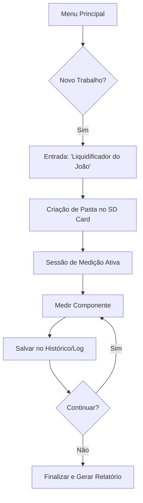

# 🚀 Roadmap de Futuras Implementações - Component Tester PRO

Este documento descreve as funcionalidades planejadas para as próximas versões do **Component Tester PRO**, focando em expansão de hardware, melhoria de workflow e recursos avançados de diagnóstico.

---

## 🛠️ Funcionalidades em Destaque

### 🌡️ Câmera Térmica (Integração)
- **Objetivo:** Permitir a visualização de pontos quentes (hotspots) em placas de circuito impresso (PCB) diretamente na tela do testador.
- **Hardware Sugerido:** Sensor AMG8833 (8x8) ou MLX90640 (32x24).
- **Recursos:**
    - Sobreposição de temperatura em tempo real.
    - Alarme visual para componentes acima de uma temperatura crítica.
    - Captura de "Snapshot Térmico" vinculado ao trabalho atual.

### 📁 Sistema de Gerenciamento de Trabalhos (Jobs)
- **Objetivo:** Organizar medições por cliente ou aparelho, criando um histórico profissional.
- **Workflow:**
    1. **Criar Trabalho:** Opção no menu principal para criar uma nova "pasta" (ex: `Liquidificador_do_João`).
    2. **Histórico Automático:** Toda medição realizada (Resistor, Transistor, ESR de Capacitor) enquanto o trabalho estiver ativo será salva em um arquivo de log (TXT ou CSV) dentro dessa pasta.
    3. **Notas Rápidas:** Opção de adicionar status (ex: "OK", "Curto", "Trocar") a cada componente medido.
- **Armazenamento:** Os dados serão persistidos no Cartão SD.

---

## 🔄 Exemplo de Fluxo de Trabalho (Workflow)

Ao selecionar a opção "Criar Trabalho", o sistema organiza os dados da seguinte forma:

---

## 💡 Sugestões de Expansão (Relevantes)

### 📊 1. Modo Osciloscópio de Baixa Frequência
- Visualização de sinais básicos (PWM, Ondas Senoidais simples) para diagnóstico de fontes chaveadas e osciladores.
- Ajuste de Time/Div e Volts/Div na tela touch.

### 📶 2. Gerador de Sinais Integrado
- Saída de frequências configuráveis (Quadrada, Senoidal e Triangular) para teste de estágios de áudio e amplificadores.

### 🔋 3. Analisador de Baterias e ESR Avançado
- Medição de resistência interna de baterias (Li-ion, Ni-MH).
- Gráfico de curva de descarga para estimativa de saúde (SoH).

### 🔍 4. Banco de Dados de Equivalentes (Offline)
- Consulta rápida no SD Card para encontrar substitutos de transistores e diodos quando o original não for encontrado no comércio local.

### 📲 5. Conectividade Bluetooth (App Mobile)
- Sincronização dos "Trabalhos" com um aplicativo Android/iOS para gerar relatórios em PDF profissionais para o cliente final.

### ⚖️ 6. Modo Comparação (Golden Sample)
- Medir um componente em uma placa boa e salvar como referência.
- O testador avisa a porcentagem de variação ao medir o mesmo componente na placa com defeito.

---

> [!TIP]
> A implementação do **Sistema de Trabalhos** é a prioridade para transformar o testador de uma ferramenta de bancada em uma estação de diagnóstico profissional.
